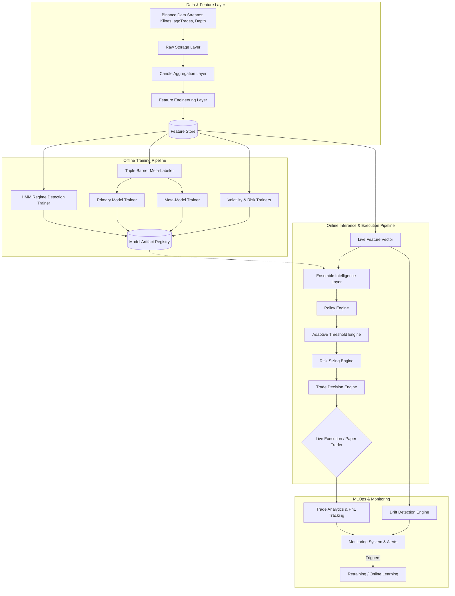
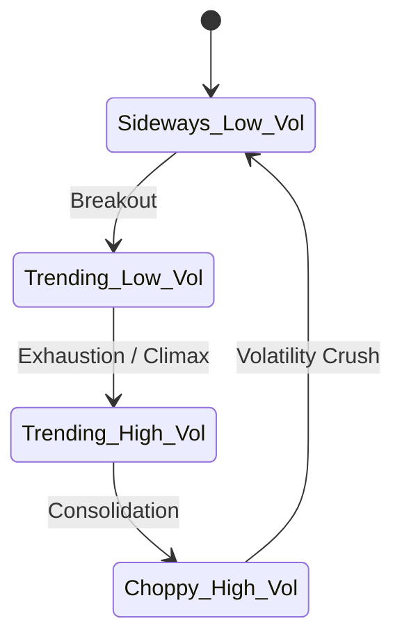
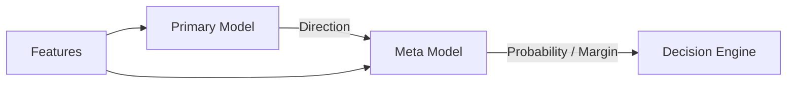
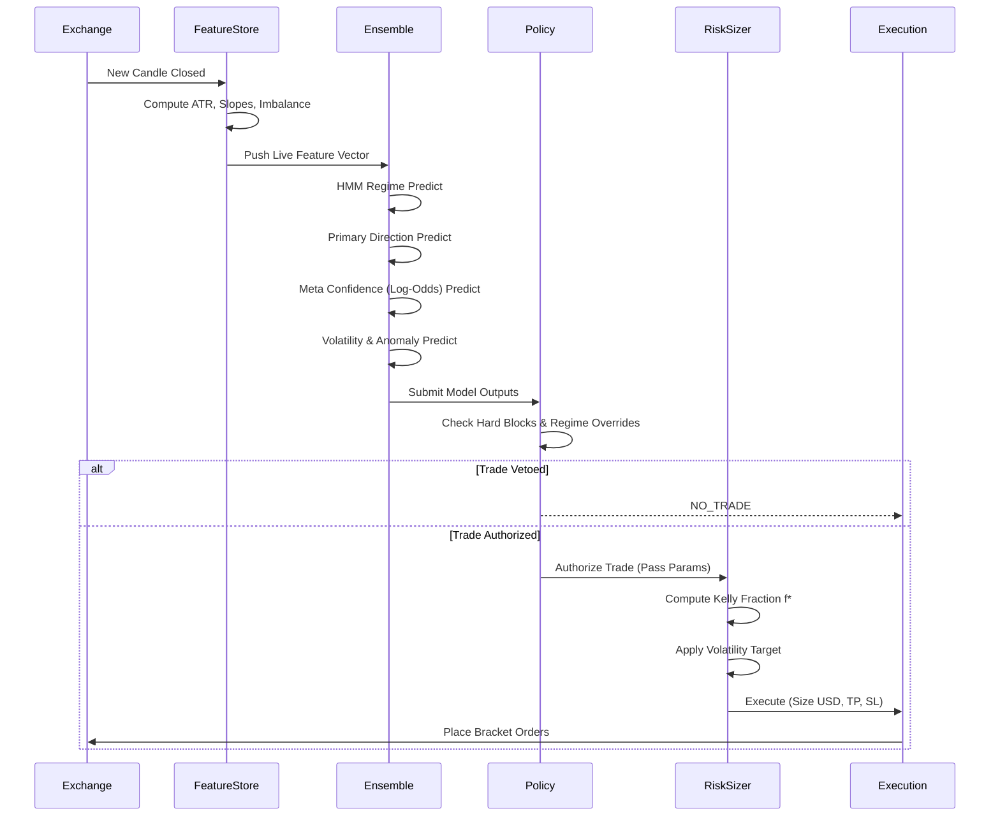

# Adaptive Probabilistic Risk Intelligence Engine
## Institutional Architecture & Execution Flow Blueprint

---

## 1. System Objective & Philosophy

The Adaptive Probabilistic Risk Intelligence Engine is an institutional-grade, regime-aware architecture designed for continuous, autonomous quantitative execution in non-stationary digital asset markets (Primary: BTCUSDT Perpetual Futures). 

**Philosophy:**
This system operates on the fundamental principle that **market regimes are non-stationary and alpha decays rapidly**. Therefore, the architecture explicitly rejects fixed-parameter trading rules, static probability thresholds, and Euclidean distance clustering. Instead, it relies on:
1. **Regime-Awareness:** Adapting behavior dynamically based on probabilistic hidden market states.
2. **Meta-Labeling (Triple-Barrier):** Decoupling directional prediction (Alpha) from probability of success (Risk).
3. **Cross-Sectional Execution:** Using Z-Score ranking to continuously adapt execution thresholds to shifting log-odds distributions.
4. **Fractional Kelly Sizing:** Executing trades only when a positive mathematical edge exists, sizing inversely to predicted volatility to achieve constant variance targeting.

---

## 2. End-to-End Execution Architecture

The system is conceptually divided into two highly decoupled environments: the **Offline Training/Research Pipeline** and the **Online Inference/Execution Pipeline**.

---

## 3. Module-by-Module System Specification

### 3.1 Data Collection & Storage Layer
**Purpose:** Ingests high-resolution market data (1m, 5m, 15m, 1h) robustly.
**Inputs:** Binance WebSocket (Live), Binance REST API (Historical).
**Outputs:** Parquet-compressed OHLCV and aggregate orderbook structures.
**Institutional Best Practice:** Avoids lookahead bias by rigidly indexing all data to the `close_time` of the bar. 

### 3.2 Feature Engineering & Feature Store
**Purpose:** Transforms raw OHLCV into stationary, orthogonal alpha signals.
**Core Features:**
- **Momentum/Trend:** `ema_20_slope`, `rsi_velocity`, `trend_strength_score`
- **Volatility:** `atr_14`, `realized_volatility`, `atr_expansion_ratio`
- **Liquidity:** `volume_delta`, `spread_ratio`, `liquidity_pressure_score`
- **Behavioral:** `emotional_risk_score`, `oversized_trade_score`
**Why it matters:** Tree-based models (XGBoost) suffer heavily from feature dilution if fed collinear features. This layer computes Spearman rank correlations to strip highly collinear redundant features, ensuring orthogonal information gain.

### 3.3 HMM Regime Detection Engine
**Purpose:** Identifies the latent market state (e.g., Trending-Low-Vol, Choppy-High-Vol).
**Models Used:** `GaussianHMM` (hmmlearn)
**Internal Logic:** 
Unlike K-Means (which assumes IID data), the HMM explicitly models the transition probabilities between states using stationary log returns and realized volatility. 
**Outputs:** `regime_cluster` (integer) and `regime_confidence` (probability).

### 3.4 Triple-Barrier Meta-Labeling Engine
**Purpose:** To generate robust training targets that account for stop-loss, take-profit, and time decay.
**Internal Logic:** 
Uses Lopez de Prado’s Meta-Labeling. 
1. **Primary Label:** The natural drift/direction over `t1` bars (Long/Short).
2. **Meta Label (Success):** Does the asset hit the Take Profit (`TP = 1.0 * ATR`) before the Stop Loss (`SL = 2.0 * ATR`) within the Time Barrier (`T1 = 12 bars`)?
**Why it matters:** Removes fixed-horizon bias and separates directional edge from risk-adjusted edge.

### 3.5 Ensemble Intelligence Layer
**Purpose:** A hierarchical ensemble of XGBoost and Isolation Forest models.
**Models Used:**
- **Primary Model (XGBoost):** Predicts `action` (1 = Long, -1 = Short).
- **Meta Model (XGBoost):** Consumes features + Primary Prediction. Outputs `meta_probability` and raw `meta_margin` (log-odds).
- **Volatility Model (XGBoost):** Predicts forward realized volatility (beats EWMA baseline).
- **Behavioral Model (Isolation Forest):** Detects systemic anomalies in the user's/system's historical execution footprint.

### 3.6 Policy Engine
**Purpose:** The final, unyielding authority layer. Applies institutional risk mandates and soft scoring adjustments.
**Internal Logic:**
- **Hard Blocks:** Instantly vetoes trades on `crash_mode`, high `amihud_illiquidity`, or Isolation Forest behavioral anomalies.
- **Regime Routing:** Adjusts internal variables based on the HMM regime. 
  - *Example:* In `choppy_high_vol`, it drastically widens SL limits and cuts maximum risk exposure by 70%.
- **Soft Adjustments:** Progressively reduces risk allocation based on `consecutive_losses` or `recent_drawdown`.

### 3.7 Adaptive Threshold Engine (Rolling Z-Score)
**Purpose:** Solves the critical issue of probability drift in non-stationary markets.
**Internal Logic:**
Instead of using fixed thresholds (e.g., `trade if prob > 0.55`), the engine maintains a rolling window (e.g., last 1000 bars) of the Meta-Model's raw log-odds output. It executes a trade *only* if the current signal's Z-Score exceeds a predefined percentile (e.g., > 95th percentile cross-sectionally).
**Why it matters:** Self-calibrates immediately to changing market regimes without requiring constant model retraining.

### 3.8 Risk Sizing Engine (Fractional Kelly)
**Purpose:** Computes the exact USD position size dynamically.
**Internal Logic:**
Uses the **Fractional Kelly Criterion**: $f^* = p - \frac{1-p}{b}$
Where $p$ = Meta-Model Probability, and $b$ = Reward:Risk Ratio (TP/SL).
- Applies a Half-Kelly constraint for safety.
- **Volatility Targeting:** Scales the Kelly fraction inversely to the XGBoost Predicted Volatility, ensuring the portfolio maintains a constant variance exposure regardless of market turbulence.

### 3.9 Paper Trading Engine
**Purpose:** An event-driven simulator for out-of-sample validation.
**Internal Logic:**
Simulates realistic institutional execution by injecting:
- 0.01% Execution Slippage
- 0.04% Maker/Taker Fees
- Strict Time-Barrier exits (T1 enforcement)
- Tracks peak equity, drawdowns, Sharpe, and regime-specific PnL.

---

## 4. Operational Execution Flow (Inference)

When a new 15-minute candle closes, the execution loop fires in under 100ms:

---

## 5. MLOps, Monitoring & Drift Detection

### 5.1 Monitoring System
**Purpose:** Tracks live system health and alpha decay.
**Metrics Monitored:**
- Prediction Distributions (Is the model skewing Short?)
- PnL Velocity (Is the equity curve deviating from backtest expectations?)
- Execution Latency.

### 5.2 Drift Detection Engine
**Internal Logic:**
Continuously calculates the **Population Stability Index (PSI)** on incoming feature vectors compared to the training set distribution.
- **Feature Drift:** If `rsi_velocity` distribution shifts significantly, an alert is triggered.
- **Concept Drift:** If the Meta-Model probability distribution diverges from actual hit rates (calibration failure), the system flags a Concept Drift.

### 5.3 Online Learning & Retraining Pipeline
**Triggers:**
1. Scheduled (e.g., Weekly continuous retraining).
2. Event-Driven (e.g., PSI threshold exceeded, Drawdown > 5%).
**Flow:**
The retraining pipeline automatically re-runs the Triple-Barrier labeler, purges collinear features, re-fits the HMM, trains the XGBoost ensemble, and stores the new artifacts into the registry, swapping them into live memory seamlessly without downtime.

---

## 6. Conservative Optimization Philosophy

This architecture operates on an assumption of **extreme skepticism** regarding model predictions. 
- A high Meta-Model probability is **meaningless** unless its Z-Score stands out relative to the local market context.
- A valid mathematical edge is **meaningless** if the HMM detects a Choppy/High-Vol regime that contradicts the risk profile.
- A perfect technical setup is **meaningless** if the Isolation Forest detects behavioral/systemic anomalies.

By stacking hierarchical ensembles, applying adaptive cross-sectional thresholding, and relying on mathematically robust sizing algorithms like Fractional Kelly, the system protects capital first, captures alpha second.
