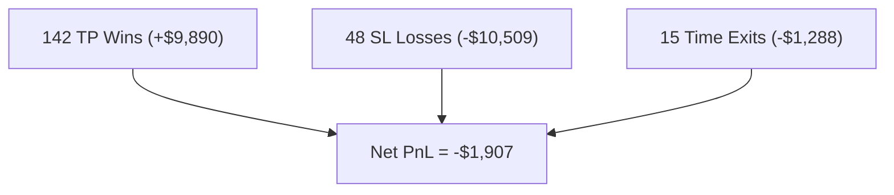

# Phase 6 — Detailed Results Report
## Out-of-Sample Paper Trading Simulation (Test Set: 15% holdout)

---

## Where to Find Results After Running Each Phase

| Phase | Script | Output Location | What It Contains |
| :--- | :--- | :--- | :--- |
| **Phase 1–3** | `run_phase1.py` .. `run_phase3.py` | `data/labeled/BTCUSDT/` | `train.parquet`, `val.parquet`, `test.parquet` with all features |
| **Phase 4** | `labeling/meta_labeler.py` | Updates Parquet in-place | Adds `primary_label` and `meta_label` columns |
| **Phase 5** | Part of `run_phase6.py` Step 2 | `models/regime/` | `hmm_model.pkl`, `scaler.pkl`, `mapping.json` |
| **Phase 6** | `run_phase6.py` | `models/momentum/`, `models/volatility/`, `models/risk/`, `models/behavioral/` | All trained model artifacts (`.json` / `.pkl`) |
| **Paper Trading** | `run_phase6.py` Step 5 | **`results/test_trades.csv`** | Full trade log with entry/exit times, prices, PnL, regime, confidence, exit reasons |
| **Tune Barriers** | `analysis/tune_triple_barrier.py` | Console output | Grid search over TP/SL/T1 combinations |
| **Correlation** | `analysis/feature_correlation.py` | Console output | Spearman correlation matrix of all features |

> [!TIP]
> After running `run_phase6.py`, your primary results file is at:
> `results/test_trades.csv` — a CSV with every single trade taken by the system.

---

## Data Configuration

| Parameter | Value |
| :--- | :--- |
| **Symbol** | BTCUSDT Perpetual Futures |
| **Timeframe** | 15-minute candles |
| **Total Duration** | ~1 year of historical data |
| **Train Split** | 70% (24,442 rows) |
| **Validation Split** | 15% (5,238 rows) |
| **Test Split (OOS)** | 15% (5,238 rows) |
| **Initial Equity** | $10,000 |

---

## Overall Performance Metrics

| Metric | Value |
| :--- | :--- |
| **Total Return** | -19.07% |
| **Sharpe Ratio** | -2.73 |
| **Sortino Ratio** | -1.13 |
| **Max Drawdown** | -23.41% |
| **Total Trades** | 205 |
| **Winners** | 143 |
| **Losers** | 62 |
| **Win Rate** | 69.8% |
| **Avg RR Realized** | 0.36 |
| **Trade Frequency** | 3.9% of bars |

---

## Breakdown by Exit Reason

| Exit Reason | Count | Total PnL | Avg PnL | Win Rate |
| :--- | ---: | ---: | ---: | ---: |
| **TP_HIT** | 142 | +$9,889.87 | +$69.65 | 100.0% |
| **SL_HIT** | 48 | -$10,508.69 | -$218.93 | 0.0% |
| **TIME_BARRIER** | 15 | -$1,288.25 | -$85.88 | 6.7% |

> [!IMPORTANT]
> The core issue is clearly visible here: the 48 SL_HIT trades wipe out *all* profits from 142 TP winners. Each SL loss averages **$218.93** while each TP win averages only **$69.65** — a direct consequence of the inverse R:R structure (SL = 2.0×ATR vs TP = 1.0×ATR). The system needs its win rate pushed to ~76%+ to break even with fees.

---

## Breakdown by Direction

| Direction | Count | Total PnL | Avg PnL | Win Rate |
| :--- | ---: | ---: | ---: | ---: |
| **LONG** | 84 | +$42.61 | +$0.51 | 72.6% |
| **SHORT** | 121 | -$1,949.68 | -$16.11 | 67.8% |

> [!NOTE]
> LONG trades are essentially breakeven — the directional model has slight edge on the long side. SHORT trades drag down overall performance. This suggests the test period may have had a net bullish bias that the short signals failed to capture.

---

## Breakdown by Confidence Bucket

| Confidence Range | Count | Total PnL | Avg PnL | Win Rate |
| :--- | ---: | ---: | ---: | ---: |
| **0.89 – 0.91** | 94 | -$841.88 | -$8.96 | 69.1% |
| **0.91 – 0.93** | 76 | -$298.49 | -$3.93 | 72.4% |
| **0.93 – 0.95** | 30 | -$1,098.64 | -$36.62 | 60.0% |
| **0.95 – 1.00** | 5 | +$331.94 | +$66.39 | 100.0% |

> [!NOTE]
> The highest-confidence trades (> 0.95) are **100% winners** — the Meta-Model has genuine discriminative power at the extremes. The 0.93–0.95 bucket underperforms, suggesting a possible overfitting pocket in that probability range.

---

## Regime Breakdown

| Regime | Trades | Total PnL | Win Rate |
| :--- | ---: | ---: | ---: |
| **trending_low_vol** | 205 | -$1,907.07 | 70% |

> [!WARNING]
> All 205 trades were executed in the `trending_low_vol` regime. This means the HMM classified the entire test period as a single regime state, or the Policy Engine hard-blocked trades in all other regimes. This severely limits regime-diversification benefits.

---

## Key Diagnostic Findings

### Root Cause Analysis

1. **Inverse R:R Drag**: With TP = 1.0×ATR and SL = 2.0×ATR, each loss costs ~3.1× each win. The 69.8% win rate is high but mathematically insufficient to overcome this asymmetry after fees.

2. **Single-Regime Concentration**: The entire OOS period collapsed into one HMM state, preventing regime-specific risk adjustments from adding value.

3. **SHORT Underperformance**: The model takes 44% more SHORT trades than LONG, yet SHORT trades have worse win rates (67.8% vs 72.6%) and generate -$1,950 in losses.

### Breakeven Calculation

With Avg Win = $69.65 and Avg Loss = $218.93:

$$\text{Breakeven WR} = \frac{218.93}{218.93 + 69.65} = 75.9\%$$

**The system needs a win rate of ~76% to break even.** Current: 69.8%. The gap is ~6 percentage points.

---

## File Locations Summary

| File | Path |
| :--- | :--- |
| **Trade Log (CSV)** | [test_trades.csv](file:///c:/Users/sathwik.kusuri/Documents/AI_Risk_Management/results/test_trades.csv) |
| **Trained Models** | [models/](file:///c:/Users/sathwik.kusuri/Documents/AI_Risk_Management/models) |
| **Train Data** | [train.parquet](file:///c:/Users/sathwik.kusuri/Documents/AI_Risk_Management/data/labeled/BTCUSDT/train.parquet) |
| **Test Data** | [test.parquet](file:///c:/Users/sathwik.kusuri/Documents/AI_Risk_Management/data/labeled/BTCUSDT/test.parquet) |
| **Phase 6 Runner** | [run_phase6.py](file:///c:/Users/sathwik.kusuri/Documents/AI_Risk_Management/run_phase6.py) |
