# Institutional Adaptive Risk Intelligence Engine
## Stage-by-Stage Engineering Handbook & Pipeline Specification

This document serves as the master engineering blueprint for the Adaptive AI Risk Intelligence System. It defines the exact execution flow, systemic interactions, and data transformations from raw market ingestion to final MLOps deployment.

---

## PHASE 1 — DATA COLLECTION

**1. Purpose**
To accurately, robustly, and continuously ingest multi-resolution market states in real-time and construct historical analogs without introducing latency or dropping critical state updates.

**2. Inputs**
- Binance WebSocket streams (live updates).
- Historical Binance REST API (Klines/AggTrades).
- Live Orderbook Depth snapshots (L2/L3 data).
- Raw Trade streams (tick-level).

**3. Outputs**
- Raw, timestamped, unaggregated market stream events.

**4. Internal Processing**
Data is collected asynchronously. Historical data is paginated and downloaded in bulk. WebSocket listeners maintain persistent connections, automatically reconnecting upon failure. Tick data is temporarily buffered in memory.

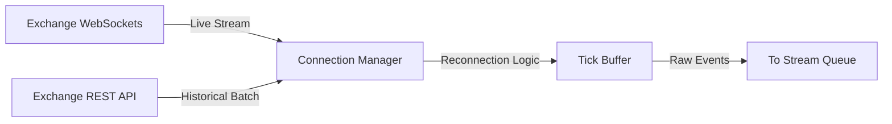

**5. Models Used**
None. This is a pure data-engineering layer.

**6. Feature Dependencies**
None.

**7. What the phase consumes**
Raw network bytes, JSON payloads, and HTTP responses.

**8. What the phase produces**
Unstructured but rigidly timestamped market events.

**9. What the phase should NOT consume**
Derived indicators or externally engineered signals. This layer must remain completely naive to market logic.

**10. Common Mistakes**
- Using local machine time instead of exchange server time.
- Dropping WebSocket frames during high-volatility spikes.
- Failing to handle exchange API rate limits gracefully.

**11. Validation Requirements**
Sequence IDs must be strictly monotonically increasing. Gaps must trigger an immediate REST API backfill.

**12. Failure Points**
WebSocket disconnections, exchange API downtime, memory leaks in the tick buffer.

**13. Monitoring Metrics & System Limits**

| Metric / Parameter | Target Value | Critical Threshold |
| :--- | :--- | :--- |
| **Max Acceptable Latency** | < 5 ms | > 50 ms |
| **Dropped Frame Rate** | 0.00% | > 0.01% |
| **Reconnection Frequency** | 0 per day | > 3 per hour |

**14. Why the phase exists**
To guarantee that downstream models are operating on the exact reality of the market, perfectly synchronized in time.

**15. How it connects to the next phase**
Passes raw payloads directly into distributed streaming queues (Kafka/Redis) for persistent storage and temporal aggregation.

---

## PHASE 2 — STREAMING & STORAGE

**1. Purpose**
To organize raw, chaotic streams into structured, queryable, time-series databases while ensuring high-throughput writes and low-latency reads for historical backtesting and live inference.

**2. Inputs**
- Raw streaming market data (from Phase 1).

**3. Outputs**
- Structured time-series data (OHLCV, Depth, Aggregations).

**4. Internal Processing**
Kafka or Redis Streams route high-frequency data to a Time-Series Database (e.g., TimescaleDB, InfluxDB). Tick data is downsampled into micro-candles. Historical archives are compressed into Parquet formats and shipped to cold storage (e.g., AWS S3) for batch training.

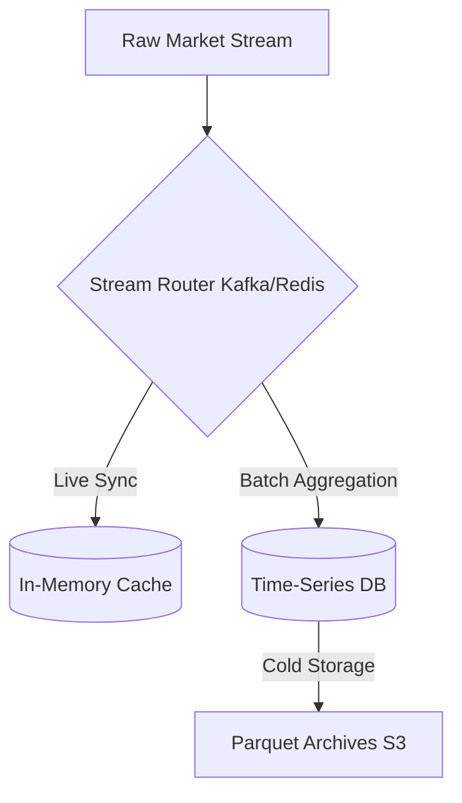

**5. Models Used**
None.

**6. Feature Dependencies**
None.

**7. What the phase consumes**
Raw events from the ingestion layer.

**8. What the phase produces**
Relational time-series rows, indexed strictly by `close_time`.

**9. What the phase should NOT consume**
Machine learning predictions or labeled targets.

**10. Common Mistakes**
- Storing data indexed by `open_time` and querying it in real-time, causing lookahead bias (the candle hasn't closed yet).
- Inefficient schema design causing massive read bottlenecks during model training.

**11. Validation Requirements**
Timestamp consistency checks across multi-timeframe aggregations (e.g., four 15m candles must perfectly equal one 1h candle in volume and price extremes).

**12. Failure Points**
Database lockups during massive write spikes (liquidation cascades), disk space exhaustion.

**13. Monitoring Metrics & System Limits**

| Metric / Parameter | Target Value | Critical Threshold |
| :--- | :--- | :--- |
| **Write IOPS** | Optimized per DB | > 85% Disk IO limit |
| **Query Latency (Live)** | < 10 ms | > 100 ms |
| **Data Retention (Hot)** | 30 Days | < 7 Days |

**14. Why the phase exists**
Machine learning models cannot consume infinite chaotic streams; they require deterministic matrices.

**15. How it connects to the next phase**
Provides structured historical batches to the Feature Engineering layer, and live cache lookups for real-time inference.

---

## PHASE 3 — FEATURE ENGINEERING

**1. Purpose**
To transform structured raw data into stationary, orthogonal alpha signals and market state representations.

**2. Inputs**
- Structured time-series data (OHLCV, Orderbook Depth).

**3. Outputs**
- Stationary Feature Vectors (a mathematical representation of the market).

**4. Internal Processing**
Applies mathematical transformations to raw prices and volumes to achieve stationarity. Computes trend slopes, ATR expansions, VWAP distances, liquidity imbalances, and emotional risk metrics. Executes a correlation purge to eliminate redundancy.

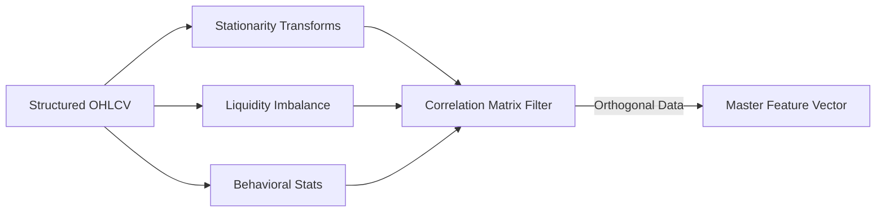

**5. Models Used**
Unsupervised correlation matrices (Spearman Rank) to drop collinear features.

**6. Feature Dependencies**
Raw Prices, Volumes, and historical user trade executions (for behavioral features).

**7. What the phase consumes**
Raw structured data from the Feature Store.

**8. What the phase produces**
A massive, perfectly aligned matrix of $X$ features.

**9. What the phase should NOT consume**
Future data. Any calculation involving data past index $T$ (e.g., centering using future mean) introduces catastrophic lookahead bias.

**10. Common Mistakes**
- Feature Dilution: Passing 20 highly correlated moving averages to a tree model.
- Non-stationarity: Feeding raw prices (e.g., BTC at $60,000) instead of returns or distances.

**11. Validation Requirements**
Augmented Dickey-Fuller (ADF) tests for stationarity. Spearman correlation < 0.85 to ensure feature orthogonality.

**12. Failure Points**
NaN propagation (e.g., dividing by zero volume), lookback window calculation errors at the start of arrays.

**13. Monitoring Metrics & System Limits**

| Metric / Parameter | Target Value | Critical Threshold |
| :--- | :--- | :--- |
| **Spearman Correlation Limit**| < 0.85 | > 0.90 |
| **NaN Frequency** | 0.00% | > 0.1% |
| **Processing Time** | < 15 ms | > 50 ms |

**14. Why the phase exists**
Models cannot understand raw prices; they understand relationships, velocities, and normalized distances.

**15. How it connects to the next phase**
Passes the orthogonalized $X$ matrix to the Label Engineering and Regime Detection layers.

---

## PHASE 4 — LABEL ENGINEERING

**1. Purpose**
To define the exact mathematical targets ($y$) the models are attempting to predict, separating directional edge from success probability.

**2. Inputs**
- Features ($X$) + Future Market Behavior.

**3. Outputs**
- Training Targets ($y_{primary}$, $y_{meta}$).

**4. Internal Processing**
Applies **Lopez de Prado’s Triple-Barrier Method**. 
1. Calculates dynamic volatility thresholds.
2. Projects these barriers forward up to a time limit $T1$.
3. Evaluates if the price hits the Take Profit or Stop Loss before the time barrier.

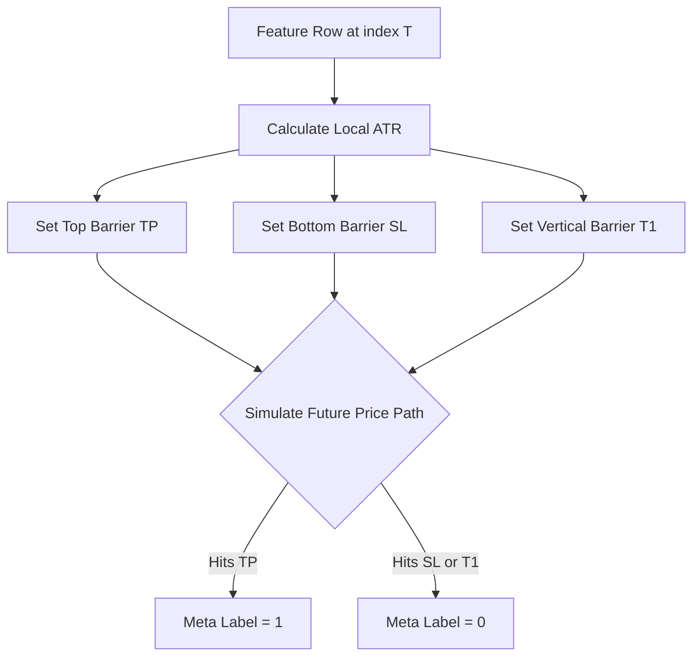

**5. Models Used**
None (purely algorithmic labeling).

**6. Feature Dependencies**
Requires volatility features (ATR, Realized Volatility) to set dynamic bounds.

**7. What the phase consumes**
Historical data extending *into the future* relative to index $T$.

**8. What the phase produces**
Strictly constrained target vectors for training.

**9. What the phase should NOT consume**
Anything outside of the defined time horizon $T1$.

**10. Common Mistakes**
- Label Leakage: Allowing the labeler to "see" the low of the current bar that the feature set hasn't processed.
- Fixed Horizon Labeling: Classifying based on "return after 10 bars" regardless of whether the asset crashed 20% during bar 3.

**11. Validation Requirements**
Target class distribution must be analyzed. If 99% of trades fail the Triple-Barrier, the barriers are too tight.

**12. Failure Points**
Infinite loops in path-dependent barrier searches, extreme volatility causing NaN targets.

**13. Monitoring Metrics & System Limits**

| Metric / Parameter | Target Value | Critical Threshold |
| :--- | :--- | :--- |
| **Take Profit Multiplier (PT)** | 1.0 * ATR | N/A |
| **Stop Loss Multiplier (SL)** | 2.0 * ATR | N/A |
| **Time Horizon (T1)** | 12 Bars | N/A |
| **Meta-Label Class Imbalance** | ~ 50/50 | < 10% or > 90% |

**14. Why the phase exists**
Models are only as good as the targets they are taught to predict. Weak labels create weak models.

**15. How it connects to the next phase**
Provides the ground-truth arrays required by Phase 6 (Model Training).

---

## PHASE 5 — REGIME DETECTION

**1. Purpose**
To classify the latent, underlying state of the market (e.g., Trending, Choppy, Volatile) without relying on arbitrary human definitions.

**2. Inputs**
- Volatility, trend, and liquidity features.

**3. Outputs**
- Regime Labels (e.g., State 0, 1, 2) + Regime Confidence Probabilities.

**4. Internal Processing**
Analyzes a rolling window of stationary returns and volatility. Learns the transition matrix of market states using probabilistic modeling, emitting both a discrete state and a continuous confidence score.

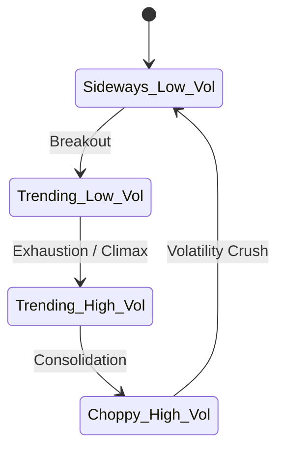

**5. Models Used**
- **Hidden Markov Models (HMM):** Best for temporal state transitions.
- **Gaussian Mixture Models (GMM):** For density-based states without temporal dependence.

**6. Feature Dependencies**
Must exclusively use stationary inputs (log returns, realized volatility).

**7. What the phase consumes**
A restricted subset of the $X$ matrix.

**8. What the phase produces**
A categorical regime tag appended to the feature vector.

**9. What the phase should NOT consume**
Directional momentum indicators (e.g., RSI). Regime models should define the *environment*, not the *direction*.

**10. Common Mistakes**
- Using K-Means clustering, which assumes data points are independent (IID), ignoring the temporal flow of time-series data.

**11. Validation Requirements**
State persistence. If the model rapid-fires between regimes every 5 minutes, it is overfitted to noise.

**12. Failure Points**
Matrix singularity during covariance calculations in extreme volatility crashes.

**13. Monitoring Metrics & System Limits**

| Metric / Parameter | Target Value | Critical Threshold |
| :--- | :--- | :--- |
| **Number of Regimes** | 4 | > 8 |
| **Average State Duration** | > 100 bars | < 10 bars |
| **Transition Probability Diagonal**| > 0.90 | < 0.50 |

**14. Why the phase exists**
Strategies that work in high-volatility trends get destroyed in low-volatility chop. The system must know the environment to route logic appropriately.

**15. How it connects to the next phase**
The Regime Label becomes a master switch for the Policy Engine and a vital feature for downstream predictive models.

---

## PHASE 6 — MODEL TRAINING

**1. Purpose**
To fit specialized machine learning models to predict highly specific market behaviors (direction, confidence, risk, behavior).

**2. Inputs**
- Clean, orthogonal features ($X$) and engineered targets ($y$).

**3. Outputs**
- Serialized Model Artifacts.

**4. Internal Processing**
Walk-forward cross-validation with Purged K-Fold splits. 
- **Primary Model:** Learns directional bias.
- **Meta Model:** Learns the probability of the Primary Model being correct under Triple-Barrier constraints.
- **Risk/Volatility Models:** Learn expected forward volatility and drawdown risks.

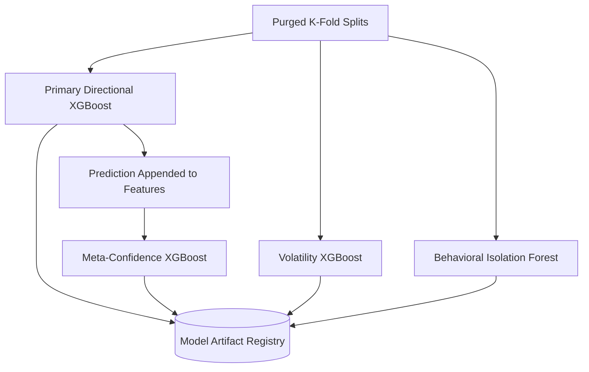

**5. Models Used**
- **XGBoost:** For non-linear, high-dimensional tabular data.
- **Isolation Forest:** For unsupervised anomaly detection (Behavioral profiling).

**6. Feature Dependencies**
Depends strictly on the Feature Store and Phase 4 labels.

**7. What the phase consumes**
Historical matrices.

**8. What the phase produces**
Pickled/Serialized model weights ready for production.

**9. What the phase should NOT consume**
Data that has not been chronologically purged. (No random cross-validation).

**10. Common Mistakes**
- Overfitting: Training until training error is zero, resulting in a model that memorizes noise.
- Leakage: Not purging the data between train and test sets to account for the $T1$ horizon of the meta-labeler.

**11. Validation Requirements**
Out-of-sample AUC > 0.52 for Meta-models; RMSE improvements over EWMA baselines for Volatility models.

**12. Failure Points**
Memory exhaustion during distributed XGBoost training on large datasets.

**13. Monitoring Metrics & System Limits**

| Metric / Parameter | Target Value | Critical Threshold |
| :--- | :--- | :--- |
| **Walk-Forward Splits** | 5 | < 3 |
| **Meta-Model AUC (OOS)** | > 0.53 | < 0.50 |
| **Purge Window Size** | >= T1 (12 bars) | < T1 |

**14. Why the phase exists**
To extract probabilistic intelligence from historical data distributions.

**15. How it connects to the next phase**
Models are loaded into the Ensemble System for live inference.

---

## PHASE 7 — ENSEMBLE SYSTEM

**1. Purpose**
To aggregate independent model predictions into a unified, probabilistic market intelligence array.

**2. Inputs**
- Live Feature Vector ($X_{live}$).

**3. Outputs**
- Unified Probabilistic Intelligence (Log-odds, Probabilities, Anomaly Scores).

**4. Internal Processing**
Loads all models into memory. Feeds $X_{live}$ through the Primary Model to get Direction. Appends Direction to $X_{live}$ and passes it through the Meta-Model to get Confidence. Concurrently queries Volatility, Risk, and Behavioral models.

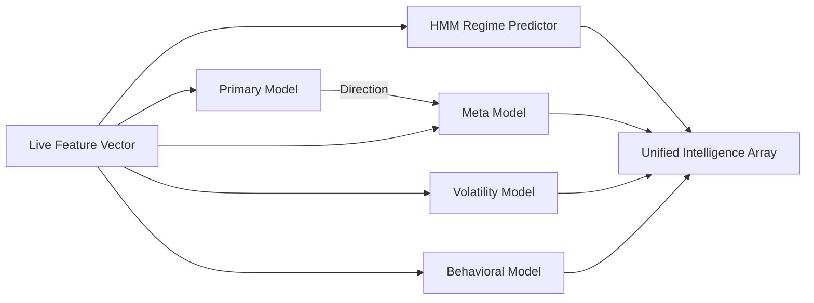

**5. Models Used**
The entire suite of trained models.

**6. Feature Dependencies**
All live features.

**7. What the phase consumes**
The live market state vector.

**8. What the phase produces**
An `EnsembleOutputs` object containing all predictions.

**9. What the phase should NOT consume**
Any hardcoded trading logic or sizing rules.

**10. Common Mistakes**
- Averaging probabilities from models trained on different objectives (e.g., averaging a classification probability with a normalized regression output).

**11. Validation Requirements**
Total inference time must remain < 50ms.

**12. Failure Points**
Model schema mismatch (passing 40 features to a model expecting 42).

**13. Monitoring Metrics & System Limits**

| Metric / Parameter | Target Value | Critical Threshold |
| :--- | :--- | :--- |
| **Inference Latency** | < 25 ms | > 100 ms |
| **Memory Footprint** | < 500 MB | > 2 GB |

**14. Why the phase exists**
Single models fail when their specific edge decays. Ensembles provide robust, multi-dimensional views of risk.

**15. How it connects to the next phase**
Passes the raw intelligence arrays to the Policy Engine.

---

## PHASE 8 — POLICY ENGINE

**1. Purpose**
To act as the unyielding institutional authority, enforcing hard risk limits and modifying model signals based on systemic context.

**2. Inputs**
- Ensemble Outputs + Risk Features (Drawdown, Streaks).

**3. Outputs**
- Allow/Reject Decisions + Soft Risk Modifiers + Regime Instructions.

**4. Internal Processing**
Executes a cascading ruleset:
1. **Hard Blocks:** Instantly vetoes trades (e.g., `crash_mode` detected, Extreme Illiquidity).
2. **Regime Routing:** Adjusts fundamental Risk:Reward expectations (e.g., widening stops in high volatility).
3. **Soft Adjustments:** Slashes risk allocations progressively if consecutive losses mount.

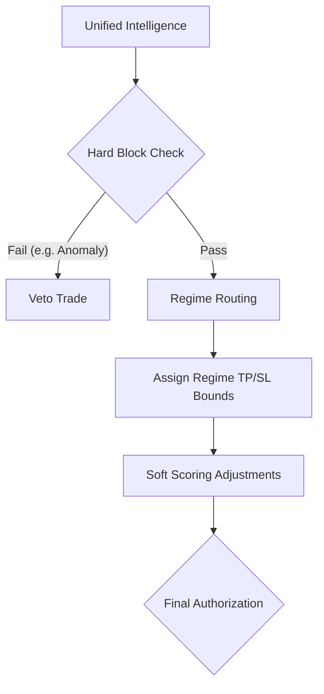

**5. Models Used**
Deterministic logic.

**6. Feature Dependencies**
Depends heavily on Regime predictions and internal portfolio state.

**7. What the phase consumes**
Intelligence outputs.

**8. What the phase produces**
A `PolicyDecision` object authorizing or vetoing execution.

**9. What the phase should NOT consume**
Model probabilities (thresholding happens later). The policy engine filters the *environment*, not the *signal strength*.

**10. Common Mistakes**
- Making the policy engine too restrictive, starving the system of trades entirely.

**11. Validation Requirements**
Must perfectly block simulated catastrophic scenarios in unit testing.

**12. Failure Points**
Circular logic in soft adjustments leading to zero risk allocations permanently.

**13. Monitoring Metrics & System Limits**

| Metric / Parameter | Target Value | Critical Threshold |
| :--- | :--- | :--- |
| **Emotional Block Threshold**| 0.80 | N/A |
| **Max Consecutive Losses** | 5 | N/A |
| **Illiquidity Threshold** | 0.15 | N/A |
| **Veto Frequency** | ~ 15% | > 40% |

**14. Why the phase exists**
Machine learning models do not understand bankruptcy. The Policy Engine protects the fund from existential ruin.

**15. How it connects to the next phase**
Passes authorized signals to the Threshold Engine.

---

## PHASE 9 — THRESHOLD ENGINE

**1. Purpose**
To dynamically determine if a model's signal is strong enough to trade, adapting to the shifting distribution of model confidence.

**2. Inputs**
- Meta-Model Probabilities / Log-Odds Margins.

**3. Outputs**
- Filtered, high-conviction trade candidates.

**4. Internal Processing**
Maintains a rolling window of the model's raw log-odds output. Calculates the cross-sectional Z-Score of the current signal against this window. Only approves trades exceeding a predefined statistical threshold (e.g., > 1.64 for 95th percentile).

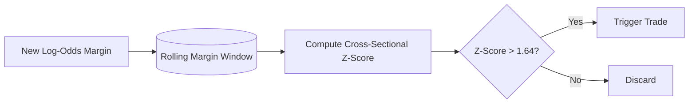

**5. Models Used**
Rolling statistical buffers.

**6. Feature Dependencies**
Raw model outputs.

**7. What the phase consumes**
A continuous stream of model probabilities.

**8. What the phase produces**
A binary True/False execution trigger.

**9. What the phase should NOT consume**
Fixed absolute thresholds (e.g., `if prob > 0.6`).

**10. Common Mistakes**
- Using probabilities from uncalibrated models for fixed thresholding (probability compression causes the model to output values between 0.49 and 0.51, triggering no trades).

**11. Validation Requirements**
The execution frequency must remain relatively stable across shifting market regimes.

**12. Failure Points**
Buffer corruption or uninitialized windows at startup leading to extreme Z-scores.

**13. Monitoring Metrics & System Limits**

| Metric / Parameter | Target Value | Critical Threshold |
| :--- | :--- | :--- |
| **Rolling Window Size** | 1000 bars | < 200 bars |
| **Z-Score Trigger (Percentile)**| 1.64 (95th %) | N/A |
| **Execution Rate** | 1% - 5% of bars | > 10% |

**14. Why the phase exists**
Model outputs drift. The threshold engine ensures we only take the absolute best trades relative to *recent* context.

**15. How it connects to the next phase**
Passes the approved trigger to the Risk Sizing Engine.

---

## PHASE 10 — RISK SIZING ENGINE

**1. Purpose**
To mathematically calculate the exact capital allocation and position size required to maximize geometric growth while enforcing constant variance.

**2. Inputs**
- Target Volatility + Meta-Model Confidence + Policy Multipliers + Current Equity.

**3. Outputs**
- Executable Risk Configuration (Position Size USD, Risk %, Exact TP/SL prices).

**4. Internal Processing**
Uses the **Fractional Kelly Criterion**.
1. Calculates Reward:Risk ratio ($b$) from the Policy Engine's dynamic TP/SL multipliers.
2. Applies Kelly formula using the Meta-Model probability ($p$).
3. Modulates the resulting fraction inversely against the Predicted Volatility to target a constant portfolio variance.
4. Calculates absolute TP/SL prices based on current ATR.

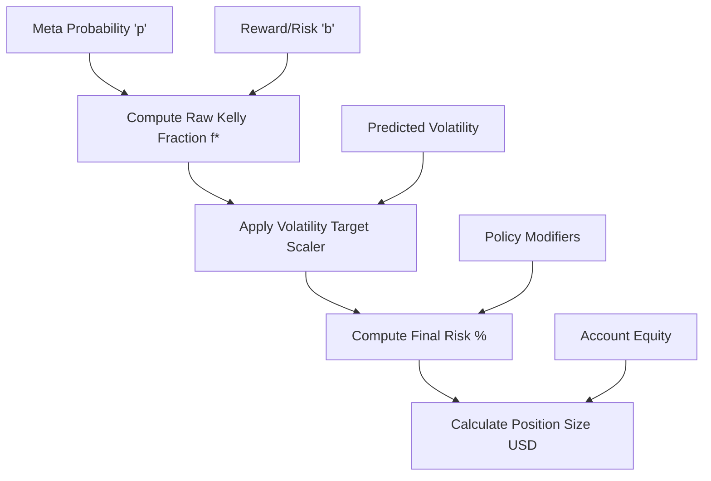

**5. Models Used**
Mathematical Optimization.

**6. Feature Dependencies**
ATR, Predicted Volatility.

**7. What the phase consumes**
Portfolio equity and statistical edge estimates.

**8. What the phase produces**
The exact USD parameters for the execution broker.

**9. What the phase should NOT consume**
Directional bias. Sizing is based on probability and risk, not direction.

**10. Common Mistakes**
- Full Kelly allocation: Mathematically guarantees catastrophic drawdowns in non-stationary environments. (Always use Half-Kelly or smaller).
- Ignoring volatility scaling: Sizing 1% risk in a 5% ATR environment is fundamentally different than 1% risk in a 0.5% ATR environment.

**11. Validation Requirements**
Calculated position sizes must never exceed the absolute `max_risk_percent` cap.

**12. Failure Points**
Division by zero if SL distance calculation fails.

**13. Monitoring Metrics & System Limits**

| Metric / Parameter | Target Value | Critical Threshold |
| :--- | :--- | :--- |
| **Kelly Fraction Multiplier** | 0.5 (Half-Kelly) | > 1.0 |
| **Max Risk per Trade** | 2.0% | N/A |
| **Negative Edge Cap** | 0.0% | N/A |

**14. Why the phase exists**
Alpha generation dictates *if* you win; position sizing dictates *how much* you keep. Sizing determines long-term survival.

**15. How it connects to the next phase**
Passes the final mathematical parameters to the Trade Decision Engine.

---

## PHASE 11 — TRADE DECISION ENGINE

**1. Purpose**
To package all upstream intelligence, policy authorizations, and risk mathematics into a standardized, immutable execution object.

**2. Inputs**
- All prior stages.

**3. Outputs**
- Final `TradeDecision` payload.

**4. Internal Processing**
Aggregates the Direction, Entry Price, TP/SL Prices, Position Size, Regime State, and Confidence into a JSON-serializable dataclass. Logs the complete decision tree for auditability.

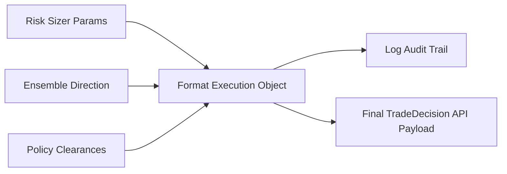

**5. Models Used**
None.

**6. Feature Dependencies**
None.

**7. What the phase consumes**
The final outputs of the inference loop.

**8. What the phase produces**
The execution instruction.

**9. What the phase should NOT consume**
Market data. The decision is already made.

**10. Common Mistakes**
- Failing to log the exact model probabilities alongside the execution instruction, making post-trade analysis impossible.

**11. Validation Requirements**
Schema validation of the `TradeDecision` object.

**12. Failure Points**
Serialization errors.

**13. Monitoring Metrics & System Limits**

| Metric / Parameter | Target Value | Critical Threshold |
| :--- | :--- | :--- |
| **Generation Latency** | < 1 ms | > 10 ms |
| **Payload Size** | < 1 KB | > 5 KB |

**14. Why the phase exists**
Provides a unified API boundary between the intelligence system (Quant) and the execution system (Engineering).

**15. How it connects to the next phase**
Routes the payload to Live Execution or Paper Trading.

---

## PHASE 12 — PAPER TRADING

**1. Purpose**
To simulate realistic, out-of-sample execution environments for strategy validation, complete with market friction.

**2. Inputs**
- `TradeDecision` instructions + historical/live price ticks.

**3. Outputs**
- Simulated Execution Results (PnL, Sharpe, Drawdown).

**4. Internal Processing**
Event-driven simulation. 
- Applies institutional Slippage and Maker/Taker Fees.
- Enforces Time-Barriers (exiting trades if $T1$ is reached).
- Checks High/Low arrays to simulate SL/TP bracket triggers.

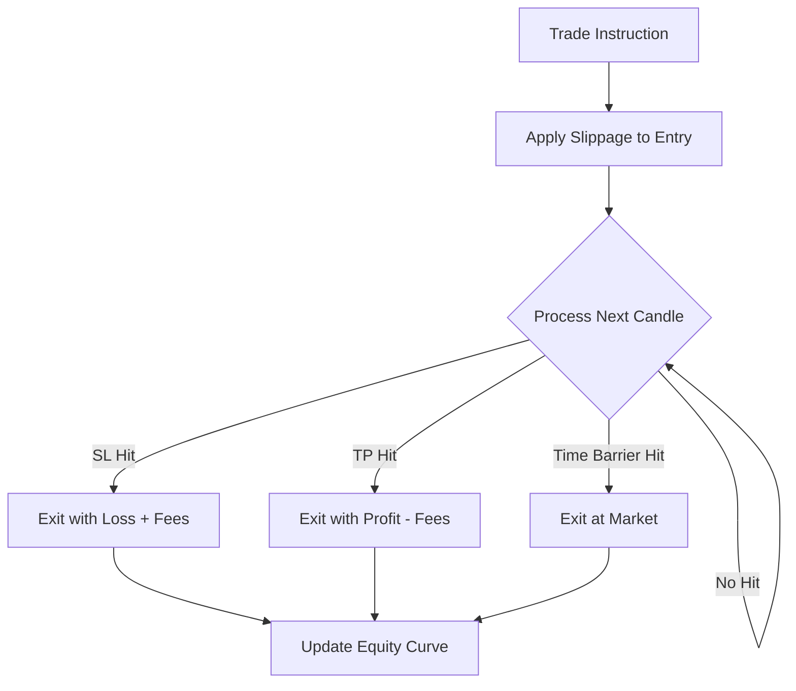

**5. Models Used**
Simulation Engine.

**6. Feature Dependencies**
High/Low/Close prices.

**7. What the phase consumes**
Trade instructions and raw market bars.

**8. What the phase produces**
An Equity Curve and performance metrics.

**9. What the phase should NOT consume**
The close price for entry (must use entry + slippage).

**10. Common Mistakes**
- False backtest optimism: Assuming you can fill 100% of volume at the exact close price with zero slippage or fees.
- Peeking: Executing a trade at the 'open' price of the bar that generated the signal.

**11. Validation Requirements**
Must accurately mimic live exchange fee structures.

**12. Failure Points**
Simulating Stop Loss and Take Profit triggers incorrectly if both are breached within the same candle (requires pessimistic resolution: assume SL hit first).

**13. Monitoring Metrics & System Limits**

| Metric / Parameter | Target Value | Critical Threshold |
| :--- | :--- | :--- |
| **Slippage Simulation** | 0.01% | N/A |
| **Fee Simulation** | 0.04% | N/A |
| **Simulated Win Rate** | > 65% | < 50% |

**14. Why the phase exists**
To prove that a theoretical mathematical edge survives contact with reality.

**15. How it connects to the next phase**
Provides the baseline metrics required for Monitoring & Drift Detection.

---

## PHASE 13 — MONITORING & DRIFT DETECTION

**1. Purpose**
To actively monitor the live production system for statistical decay, ensuring the models are operating within their trained boundaries.

**2. Inputs**
- Live Features + Live Predictions + Live PnL.

**3. Outputs**
- System Alerts + Automated Retraining Triggers.

**4. Internal Processing**
- **Feature Drift:** Calculates Population Stability Index (PSI) to check if the current market features have fundamentally shifted away from the training distribution.
- **Concept Drift:** Monitors the live Win Rate vs. Expected Meta-Model Probabilities. If the model is highly confident but losing consistently, the underlying market mechanics have changed.

```mermaid
graph LR
    A[Live Data Streams] --> B[Compute PSI (Feature Drift)]
    A --> C[Track Win Rates (Concept Drift)]
    B & C --> D{Threshold Exceeded?}
    D -- Yes --> E[Trigger Alert & Retrain]
    D -- No --> F[Log Telemetry]
```

**5. Models Used**
Statistical tests (PSI, Kolmogorov-Smirnov).

**6. Feature Dependencies**
Requires cached baseline distributions from Phase 6.

**7. What the phase consumes**
Telemetry from the inference loop.

**8. What the phase produces**
Health metrics and trigger events.

**9. What the phase should NOT consume**
Delayed feedback. Monitoring must be real-time.

**10. Common Mistakes**
- Alert fatigue: Setting drift thresholds too tight, causing the system to flag drift during normal regime transitions.

**11. Validation Requirements**
False-positive rates on drift alerts must be tuned.

**12. Failure Points**
Memory leaks in telemetry accumulation.

**13. Monitoring Metrics & System Limits**

| Metric / Parameter | Target Value | Critical Threshold |
| :--- | :--- | :--- |
| **PSI Limit (Per Feature)** | < 0.10 | > 0.20 |
| **Expected Calibration Error**| < 5% | > 15% |
| **Drawdown Alert** | N/A | > 5% Trailing |

**14. Why the phase exists**
Production ML systems decay instantly. The market is adversarial. Without monitoring, a profitable model will silently bleed capital.

**15. How it connects to the next phase**
Fires webhooks to trigger Phase 14.

---

## PHASE 14 — ONLINE LEARNING & RETRAINING

**1. Purpose**
To continuously adapt the system to new market realities without manual intervention, handling concept drift safely.

**2. Inputs**
- New market data + Triggers from Phase 13.

**3. Outputs**
- Updated, version-controlled Model Artifacts.

**4. Internal Processing**
Initiates a rolling batch retraining sequence. Fetches the latest N months of data from the Feature Store, re-runs the Triple-Barrier labeler, drops collinear features, and retrains the XGBoost and HMM models.

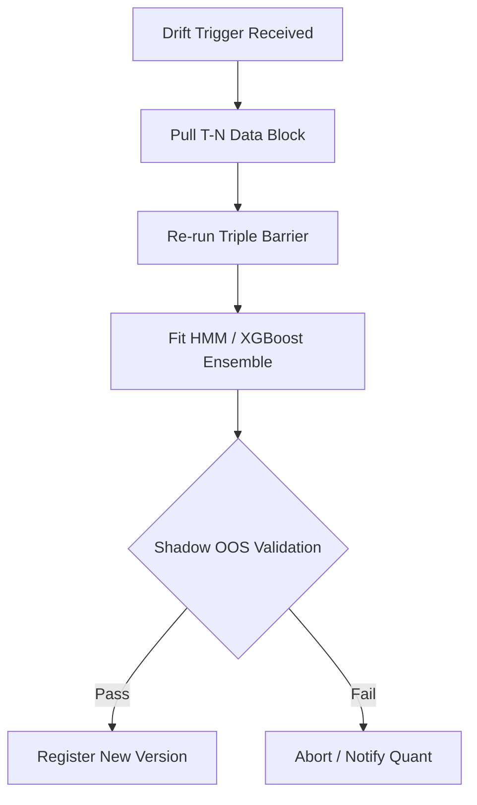

**5. Models Used**
All models from Phase 6.

**6. Feature Dependencies**
Depends heavily on structured data availability.

**7. What the phase consumes**
Fresh historical batches.

**8. What the phase produces**
A new generation (version) of models.

**9. What the phase should NOT consume**
Data that has not been rigorously validated for structural integrity (e.g., missing candles).

**10. Common Mistakes**
- Catastrophic Forgetting: Dropping all historical data and training only on the last 2 weeks, causing the model to forget how to handle long-term market crashes. (Must use blended rolling windows).

**11. Validation Requirements**
The newly trained model *must* outperform the current production model in a shadow-mode paper test before deployment is authorized.

**12. Failure Points**
Training pipeline crashes due to data anomalies, halting system evolution.

**13. Monitoring Metrics & System Limits**

| Metric / Parameter | Target Value | Critical Threshold |
| :--- | :--- | :--- |
| **Retraining Window (Lookback)**| 6 Months | < 1 Month |
| **OOS Performance Delta required**| > 2% | < 0% |
| **Retraining Duration** | < 1 Hour | > 6 Hours |

**14. Why the phase exists**
To automate the maintenance of edge. 

**15. How it connects to the next phase**
Pushes the validated model artifacts into the MLOps Deployment registry.

---

## PHASE 15 — DEPLOYMENT & MLOPS

**1. Purpose**
To serve the complete inference pipeline in a highly available, scalable, and secure institutional environment.

**2. Inputs**
- Model Artifacts + Inference Code.

**3. Outputs**
- A live API endpoint and execution daemon.

**4. Internal Processing**
- **Dockerization:** The entire Python environment, Feature Engineering pipeline, and Inference engine are containerized.
- **Model Registry:** MLflow or similar tracks model versions. 
- **Orchestration:** Kubernetes scales the inference pods and handles failovers.
- **API:** FastAPI exposes internal telemetry and manual override switches.

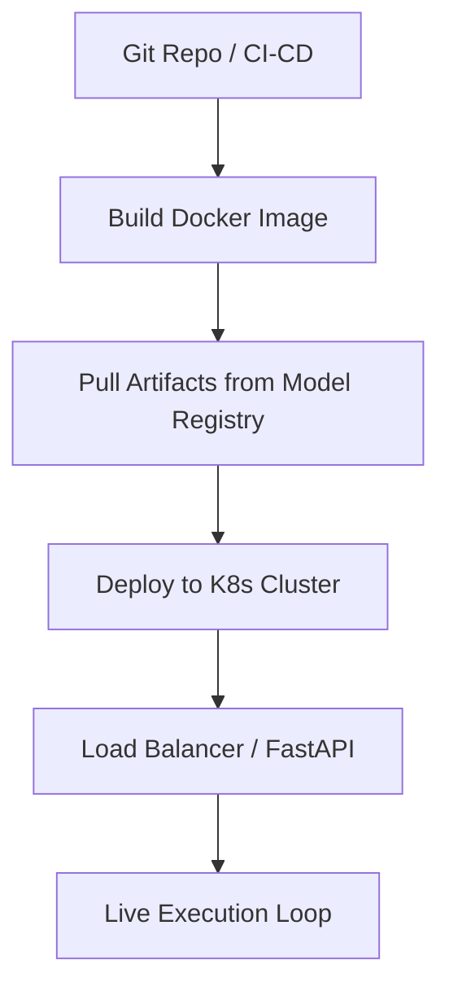

**5. Models Used**
Production-grade serving infrastructure.

**6. Feature Dependencies**
Network access to exchange APIs and local Feature Store.

**7. What the phase consumes**
Validated docker images and model weights.

**8. What the phase produces**
Live market orders.

**9. What the phase should NOT consume**
Development-branch code. Strict CI/CD gating is required.

**10. Common Mistakes**
- Deploying stateful applications in stateless containers without remote cache (e.g., restarting the container wipes the Z-Score rolling window).

**11. Validation Requirements**
Zero-downtime rolling deployments, strict API authentication.

**12. Failure Points**
Network partition from the exchange, out-of-memory (OOM) kills by Kubernetes.

**13. Monitoring Metrics & System Limits**

| Metric / Parameter | Target Value | Critical Threshold |
| :--- | :--- | :--- |
| **API Response Uptime** | 99.99% | < 99.00% |
| **Container Memory Target** | ~ 1 GB | > 4 GB (OOM risk) |
| **Auto-Scale Trigger** | 70% CPU load| > 90% CPU load |

**14. Why the phase exists**
A brilliant quantitative model is useless if it crashes on a server and misses a critical risk-reduction execution.

**15. How it connects to the next phase**
This is the final phase. The system loops endlessly, feeding execution data back into Phase 1 to begin the cycle anew.
