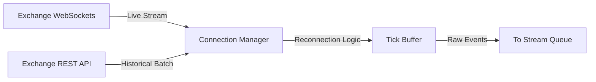

# Phase 1: Data Collection

## 1. Primary Purpose & Problem Solved
The **Data Collection** phase is the absolute foundation of the Institutional Adaptive Risk Intelligence Engine. Its primary purpose is to continuously and robustly ingest multi-resolution market states in real-time and construct historical analogs without introducing latency or dropping critical state updates.

### Catastrophic Failure Mode
If this phase is skipped or poorly engineered, the system will suffer from **temporal misalignment and state corruption**. Specifically:
* **Information Asymmetry:** Downstream machine learning models and policy engines will operate on outdated or incomplete market states, leading to disastrous, lagging trade execution.
* **Data Gaps & Synchronization Errors:** Unhandled WebSocket disconnects or dropped frames during periods of extreme volatility will lead to corrupted historical archives, creating invalid training signals and rendering backtesting results completely unrealistic.
* **Rate-Limit Lockout:** Naive connection management can trigger exchange-side rate limit bans, blinding the institutional engine during crucial, high-volatility events (e.g., liquidation cascades) when risk monitoring is most critical.

---

## 2. Architecture & Data Flow
* **Inputs:** 
  * Live Binance WebSocket streams (raw trades, depth updates, and book ticker).
  * Historical Binance REST API endpoints (Klines/AggTrades for backfilling).
  * Live Orderbook Depth snapshots (L2/L3 orderbook depth).
  * Raw tick-level trade streams.
* **Outputs:** 
  * Raw, timestamped, unaggregated market stream events stored in high-performance memory buffers before ingestion into the streaming backbone.
* **Internal Processing:**
  1. **Connection Management:** Establish and maintain highly persistent, low-latency WebSocket connections via a robust `Connection Manager` with integrated heartbeat monitoring and auto-reconnection logic.
  2. **Asynchronous Ingestion:** Network payloads are fetched asynchronously using non-blocking I/O.
  3. **Sequence Validation:** Ingested events are checked to ensure their sequence IDs (`u` and `U` for orderbook updates) are strictly monotonically increasing. Any gap in the sequence immediately triggers an asynchronous REST backfill request to patch the missing historical states.
  4. **Temporal Synchronization:** Timestamps are normalized using the exchange server's matching-engine time rather than local machine ingestion time, completely neutralizing local clock-drift issues.
  5. **Tick Buffering:** Raw events are temporarily staged in a high-speed, thread-safe memory ring buffer (`Tick Buffer`) to decouple high-frequency network I/O from downstream storage and transformation systems.

---

## 3. Deep Dive: What to Study in Detail
To master this phase, you must deeply understand high-performance network engineering and exchange microstructures:
* **Asynchronous Programming Paradigms:** Study Python's `asyncio` framework, event loops, and non-blocking I/O operations under heavy network loads.
* **WebSocket Protocol Internals:** Understand WebSocket framing, keep-alive ping/pong heartbeats, connection scaling, and backpressure management.
* **Exchange Rate-Limiting Algorithms:** Study Token Bucket and Leaky Bucket algorithms utilized by institutional API gateways, and how to build adaptive rate-limit throttlers.
* **Tick Buffer Data Structures:** Analyze thread-safe circular buffers (ring buffers), memory management, and garbage collection optimization in garbage-collected languages like Python.
* **Network Tuning and Latency Optimization:** Learn about TCP/IP socket buffers, TCP_NODELAY (Nagle's algorithm), and network interface card (NIC) tuning for low-latency financial feeds.

---

## 4. System Boundaries & Dependencies
* **What it MUST NOT do:**
  * **No Market Logic:** This phase must remain completely naive to market dynamics, indicators, or trading logic. It must **never** calculate moving averages, returns, volatility, or features.
  * **No Logical Ordering / Filtering:** It must not drop events based on content (e.g., ignoring small trades). All raw exchange data must be captured transparently.
  * **No Local Timing Bias:** It must never overwrite exchange transaction timestamps with local machine time.
* **Connection to Next Phase:**
  Raw, timestamped, and sequenced payloads are pushed directly into distributed streaming queues (such as Apache Kafka topics or Redis Streams) in Phase 2. This creates an asynchronous, durable boundary between network ingestion and persistent storage.
