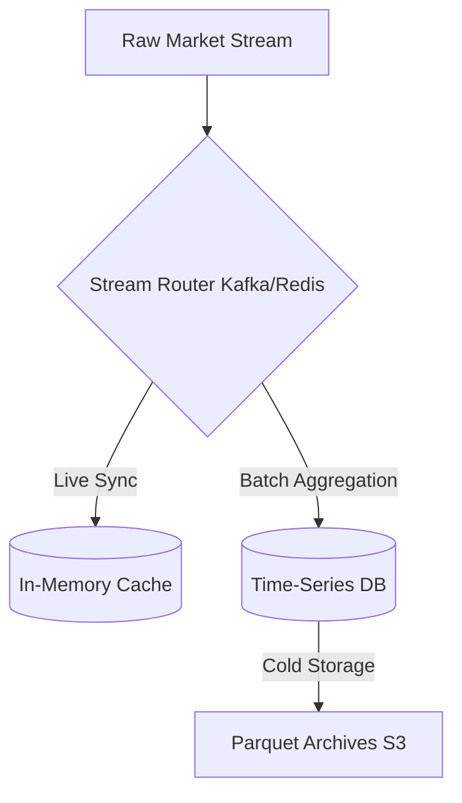

# Phase 2: Streaming & Storage

## 1. Primary Purpose & Problem Solved
The **Streaming & Storage** phase acts as the persistent nervous system of the Institutional Adaptive Risk Intelligence Engine. Its primary purpose is to ingest high-throughput, chaotic raw market streams from Phase 1, organize them into structured, queryable formats, and store them in highly optimized time-series and analytical databases. It guarantees both low-latency lookups for live production inference and massive, parallel read throughput for historical backtesting and offline model training.

### Catastrophic Failure Mode
Skipping or poorly constructing this database and streaming layer will result in:
* **Catastrophic Lookahead Bias:** Storing and querying candles indexed by their `open_time` during live inference. This permits live algorithms to read data that represents future price points within that window, rendering backtests highly profitable on paper but completely bankrupting in live environments.
* **Database Deadlocks during Market Panics:** During extreme volatility spikes (such as liquidation cascades or flash crashes), raw trade volume increases by orders of magnitude. A basic database architecture will lock up under the sudden, massive write load, causing live execution algorithms to crash or run blind precisely when risk control is needed.
* **Analytical Inefficiency:** Without optimized partitioning and compression (e.g., raw SQL inserts without index alignment), loading multi-gigabyte datasets for feature engineering will take hours instead of seconds, stalling the quantitative research cycle.

---

## 2. Architecture & Data Flow
* **Inputs:**
  * Raw streaming market data events (from Phase 1's `Tick Buffer`).
* **Outputs:**
  * Structured, indexed time-series tables (OHLCV bars, Level 2 orderbook snapshots, trade aggregations).
  * Highly compressed analytical data packages (Parquet archives in cold storage) for model training.
  * Real-time cache entries for instant feature extraction.
* **Internal Processing:**
  1. **Stream Routing:** Apache Kafka or Redis Streams act as the message bus. A distributed broker routes raw ticks, orderbook updates, and system events to their designated streaming queues.
  2. **Live Caching:** In-memory key-value databases (e.g., Redis) maintain a rolling window of recent market states (e.g., last 10,000 trades/ticks) for sub-millisecond lookups during live inference.
  3. **Temporal Aggregation:** Tick streams are consumed by a downsampling microservice that aggregates raw events into micro-candles (e.g., 1-second, 1-minute, or non-time-based volume/tick bars).
  4. **Time-Series Persistence:** Downsampled bars and raw tick summaries are written in batches to a Time-Series Database (e.g., TimescaleDB, InfluxDB) utilizing partition-aware bulk insert protocols.
  5. **Cold Storage Archiving:** At regular intervals (e.g., daily), historical data is exported, compressed into columnar Apache Parquet format, and transferred to distributed object storage (e.g., AWS S3 or MinIO) for cost-efficient, high-performance batch analytics.

---

## 3. Deep Dive: What to Study in Detail
To design and maintain this heavy data engineering layer, focus on the following disciplines:
* **Time-Series Database Architecture:** Study how TimescaleDB handles hypertable partitioning, chunk size optimization, and transactional write-path scaling.
* **Distributed Stream Orchestration:** Understand Apache Kafka's partition keys, offsets, consumer group rebalancing, and guarantee levels (e.g., At-Least-Once vs. Exactly-Once processing).
* **Columnar Storage Formats:** Learn how Apache Parquet structures data, how dictionary and run-length encoding compression works, and the performance characteristics of Snappy vs. Gzip.
* **Advanced Financial Bar Aggregations:** Study Marcos Lopez de Prado's methodologies on non-standard bar construction:
  * **Tick Bars:** Aggregating data by a fixed number of transactions.
  * **Volume Bars:** Aggregating by a fixed amount of traded asset volume.
  * **Dollar/Value Bars:** Aggregating by a fixed transaction value, which remains stable across exponential price changes.
* **Lookahead Bias Prevention:** Study the exact indexing strategies needed to index time-series database records strictly by `close_time` (the physical moment the window closed) to ensure absolute safety.

---

## 4. System Boundaries & Dependencies
* **What it MUST NOT do:**
  * **No Inline Machine Learning Predictions:** This layer is purely for data persistence and basic structural transformation. It must **never** load ML models or store predictions in the primary time-series tables.
  * **No Arbitrary Human Labels:** Target labels must not be generated or persisted in this phase.
  * **No Blocking Queries on Ingestion Threads:** The database write threads must never block the streaming consumers. If a write backlog occurs, the system must utilize backpressure signals or persistent disk queues.
* **Connection to Next Phase:**
  Phase 2 provides structured, deterministic query APIs and historical Parquet files to Phase 3 (Feature Engineering). The clean separation ensures that Phase 3 can query both historical data frames (for offline training) and real-time rolling memory windows (for live inference) using the exact same interface.
