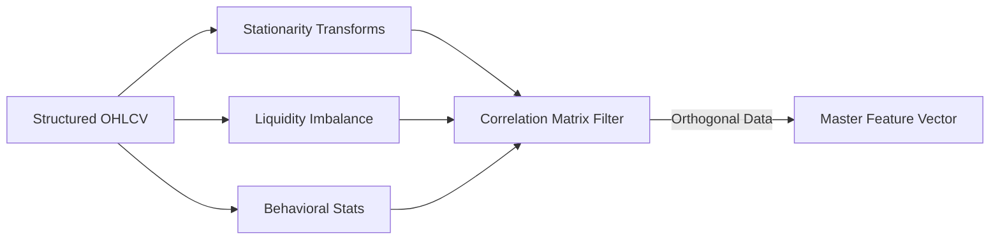

# Phase 3: Feature Engineering

## 1. Primary Purpose & Problem Solved
The **Feature Engineering** phase acts as the mathematical translator of the Institutional Adaptive Risk Intelligence Engine. Its primary purpose is to convert raw, non-stationary price and volume time-series from Phase 2 into highly stationary, orthogonal feature vectors. These vectors serve as a robust representation of market physics, allowing machine learning models to identify patterns that generalize successfully out-of-sample.

### Catastrophic Failure Mode
If this phase is designed improperly, the system will suffer from **information leakage and feature collinearity**, leading to two devastating failures:
* **Catastrophic Generalization Failure:** Machine learning models fed raw prices (e.g., Bitcoin at $60,000) or non-stationary moving averages will fail instantly when the price regimes drift to new levels (e.g., $100,000). The model has only learned absolute numerical levels, not relative mechanics.
* **Catastrophic Lookahead Leakage:** A feature engineering pipeline that performs global normalization (e.g., calculating z-scores or scaling features using the mean and standard deviation of the entire historical dataset) leaks future data into the past. Downstream models trained on these vectors will show massive, simulated backtest profits but will hemorrhage capital instantly in live production.
* **Model Collinearity Overload:** Feeding highly correlated features (e.g., 20 different variations of standard moving averages) to tree-based models like XGBoost will dilute feature importance scores, expand the model's memory footprint, and cause severe overfitting to historical noise.

---

## 2. Architecture & Data Flow
* **Inputs:**
  * Structured historical and live time-series data (OHLCV, Orderbook Depth, VWAP, Order Flow Ticks) from Phase 2.
  * Internal portfolio execution history (for behavioral features).
* **Outputs:**
  * Clean, stationary, and orthogonal Feature Matrix ($X$) containing aligned records indexed strictly by closed timestamps.
* **Internal Processing:**
  1. **Stationarity Transformations:** Apply fractional differentiation or log-differencing to raw price and volume series. This removes trend components (achieving mathematical stationarity) while retaining maximum memory of historical price pathing.
  2. **Microstructure Calculation:** Compute real-time liquidity imbalances, Order Book Imbalance (OBI), Volume Imbalance, bid-ask spread dynamics, and bid-ask queue ratios.
  3. **Volatility & Trend Velocities:** Calculate dynamic ATR expansions, realized volatility metrics (Parkinson, Garman-Klass), and distance vectors relative to VWAP curves.
  4. **Collinearity Filter (Correlation Purging):** Calculate a Spearman Rank Correlation matrix across all raw features. Group and filter features exceeding a strict threshold (e.g., correlation $\ge 0.85$), retaining only the highly orthogonal features.
  5. **Feature Serialization:** Output the aligned $X$ matrix to the Feature Store for training and real-time inference.

---

## 3. Deep Dive: What to Study in Detail
To architect a robust financial feature engineering pipeline, you must master several statistical and quantitative concepts:
* **Mathematical Stationarity & Differencing:** Study the difference between integer differencing (which strips away all historical price memory) and **Fractional Differentiation** (as detailed in Marcos Lopez de Prado's "Advances in Financial Machine Learning"). Master how to select the optimal differencing parameter $d$ that preserves memory while passing stationarity tests.
* **Statistical Stationarity Tests:** Understand the Augmented Dickey-Fuller (ADF) test, the Kwiatkowski-Phillips-Schmidt-Shin (KPSS) test, and their corresponding critical value thresholds.
* **Feature Orthogonalization:** Study techniques like Spearman Rank Correlation, Hierarchical Correlation Clustering (HRP-based feature grouping), and Principal Component Analysis (PCA) to eliminate collinearity.
* **Microstructure and Order Flow:** Learn how to calculate Order Book Imbalance (OBI), Volume Inflow/Outflow dynamics, and the Kyle Lambda metric to capture real-time supply-demand imbalances.
* **Non-Linear Volatility Estimation:** Study volatility estimators such as the Parkinson Estimator (utilizing High/Low ranges) and the Garman-Klass Estimator (utilizing Open/High/Low/Close details) to capture intraday variance.
* **Rolling Leakage Prevention:** Understand how to design strict online scaling classes that update feature scaling parameters (e.g., rolling mean and standard deviation) using *only* historical windows, avoiding any future peeking.

---

## 4. System Boundaries & Dependencies
* **What it MUST NOT do:**
  * **No Future Peeking / Centering:** Under no circumstances should features be centered or scaled using global statistics of the dataset. Everything must be calculated via strictly rolling causal windows.
  * **No Label Generation:** This phase is completely independent of the targets. It must **never** access or generate future trade returns or exit criteria.
  * **No Hand-Crafted "Heuristic" Rules:** The phase must avoid complex, arbitrary trade rules (e.g., "if feature X > 5, then trade"). It simply generates raw numerical representations of the market state.
* **Connection to Next Phase:**
  The generated orthogonalized feature matrix $X$ is fed simultaneously into Phase 4 (Label Engineering) to build aligned historical targets ($y$), Phase 5 (Regime Detection) to classify latent market states, and Phase 6 (Model Training) for supervised fitting.
