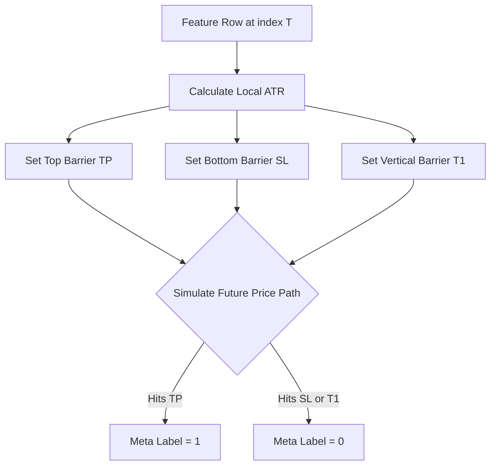

# Phase 4: Label Engineering

## 1. Primary Purpose & Problem Solved
The **Label Engineering** phase is the behavioral trainer of the Institutional Adaptive Risk Intelligence Engine. Its primary purpose is to mathematically define the exact targets ($y_{primary}, y_{meta}$) that downstream models are trained to predict. Rather than predicting simple returns over a fixed window, this phase models the realistic, path-dependent journey of a trade, separating directional prediction from execution probability.

### Catastrophic Failure Mode
Skipping this phase or using naive, fixed-horizon labels will result in:
* **The "Invisible Stop Out" Backtest Illusion:** A fixed-horizon labeler (e.g., classifying based on the return exactly 10 bars from now) might classify a trade as a "win" (+2%) even if the asset crashed 20% on bar 3. In live trading, the position would have been completely liquidated or stopped out on bar 3. Downstream models trained on these naive labels will learn highly dangerous strategies that routinely ignore massive intra-trade drawdowns.
* **Severe Label Leakage:** Allowing the labeler to evaluate future path parameters using information that the feature set at time $T$ could not have legally observed. This creates artificially inflated training scores that fail instantly in live execution.
* **Extreme Class Imbalance:** If fixed-barrier metrics are set without accounting for dynamic volatility, the labels will become highly skewed. For example, during low-volatility periods, a static profit target will never be hit, leading to a 99% fail label rate and starving the ML models of positive training signals.

---

## 2. Architecture & Data Flow
* **Inputs:**
  * Aligned Feature Vectors ($X$) from Phase 3.
  * Future raw market tick and bar data (to evaluate future price paths).
  * Dynamic volatility metrics (e.g., rolling Average True Range or Exponentially Weighted Moving Standard Deviation).
* **Outputs:**
  * Primary target labels ($y_{primary}$) representing directional outcomes (e.g., Buy, Sell, Hold).
  * Meta-target labels ($y_{meta}$) representing trade success probabilities (e.g., 1 if primary signal hit Take Profit first, 0 if it hit Stop Loss or timed out first).
* **Internal Processing:**
  1. **Dynamic Volatility Anchor:** For each index $T$, calculate the localized market volatility (e.g., 100-bar rolling standard deviation).
  2. **Triple-Barrier Projections:** Project three distinct mathematical barriers forward in time:
     * **Upper Barrier (Take Profit):** Placed at a dynamic distance above the current price ($Price_T + pt \cdot \sigma_T$).
     * **Lower Barrier (Stop Loss):** Placed at a dynamic distance below the current price ($Price_T - sl \cdot \sigma_T$).
     * **Temporal Barrier (Time Out):** Set a maximum time horizon $T1$ (e.g., 12 bars).
  3. **Path Simulation:** Step through the future price path bar-by-bar.
  4. **Target Assignment:**
     * If the price touches the Upper Barrier first, assign $y_{primary} = 1$ and $y_{meta} = 1$.
     * If the price touches the Lower Barrier first, assign $y_{primary} = 0$ (or -1) and $y_{meta} = 0$.
     * If the price reaches the Temporal Barrier $T1$ without touching either price barrier, assign the label based on the path return at $T1$ or assign $y_{meta} = 0$ (neutral timeout).
  5. **Purging Prep:** Compute sample overlap metrics to prevent downstream correlation leakage.

---

## 3. Deep Dive: What to Study in Detail
To design a state-of-the-art path-dependent labeler, you must master the following quantitative methods:
* **The Triple-Barrier Method:** Study the core mathematical formulation of Marcos Lopez de Prado's Triple-Barrier Method. Understand how to dynamically set profit taking ($pt$) and stop loss ($sl$) multipliers relative to volatility.
* **Meta-Labeling (Secondary Classification):** Deeply study the concept of Meta-Labeling. Learn why we train a secondary model to predict the *probability of success* of a primary model rather than forcing a single model to solve both direction and sizing. Meta-labeling maximizes the F1-score and precision of the system.
* **Sample Concurrency and Uniqueness:** Understand that because trade paths overlap in time, the labels are not independent and identically distributed (IID). Study how to calculate the average uniqueness of labels to properly weight samples and avoid training bias.
* **Dynamic Volatility Scaling:** Study Exponentially Weighted Moving Standard Deviation (EWMSD) and Average True Range (ATR) as mechanisms for scaling price distances across highly non-stationary environments.
* **Label Distribution Balancing:** Understand class balance evaluation and metrics (e.g., SMOTE or sample-weighting based on average uniqueness) to ensure target distributions do not starve learning algorithms.

---

## 4. System Boundaries & Dependencies
* **What it MUST NOT do:**
  * **No Static Price Target Barriers:** Never use static dollar or pip thresholds (e.g., $100 profit target). Barriers must **always** adapt dynamically to localized volatility.
  * **No Inline Model Training:** This phase prepares the targets. It does not train models.
  * **No Looking Beyond $T1$:** The path simulator must never examine price behavior past the temporal limit $T1$ to avoid structural target leakage.
* **Connection to Next Phase:**
  The generated target matrices ($y_{primary}, y_{meta}$) are aligned chronologically with the feature matrix $X$ and passed directly into Phase 6 (Model Training) to serve as ground-truth outputs. They are also utilized to evaluate environmental regime transitions in Phase 5.
