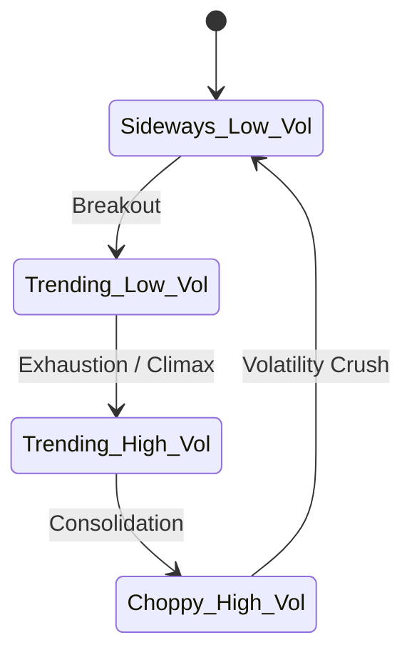

# Phase 5: Regime Detection

## 1. Primary Purpose & Problem Solved
The **Regime Detection** phase acts as the environmental navigator of the Institutional Adaptive Risk Intelligence Engine. Its primary purpose is to identify the latent, mathematically defined state of the market (e.g., Low-Volatility Choppy, High-Volatility Trending, Volume-Dry Consolidation) without relying on arbitrary, lagged human indicators. 

### Catastrophic Failure Mode
If the system lacks an adaptive regime detection layer, it will suffer from **structural strategy breakdown**:
* **The "Chop Decay" Blowout:** A highly profitable trend-following model will generate continuous buy and sell signals. When the market enters a low-volatility, range-bound "chop" regime, the trend-following strategy will buy resistance and sell support repeatedly, bleeding capital through "whipsaws."
* **The "IID" Clustering Fallacy (K-Means Overfitting):** Naively using static clustering algorithms like K-Means assumes that market states are independent and identically distributed (IID) over time. This ignores the temporal momentum of markets, causing the system to rapidly oscillate between regime states every few minutes (chattering). This leads to high execution costs and system instability.
* **Covariance Matrix Singularity:** During high-stress market shocks (e.g., flash crashes), raw correlation matrices collapse to 1. Without dynamic, robust regime classification, downstream portfolio optimization algorithms will crash due to matrix inversion failures.

---

## 2. Architecture & Data Flow
* **Inputs:**
  * Aligned, stationary volatility, trend velocity, and liquidity features from Phase 3 (specifically log returns, realized volatility, and orderbook depth imbalances).
* **Outputs:**
  * Categorical Regime Labels (e.g., State 0, State 1, State 2, State 3) representing the classified market state.
  * Continuous Regime Confidence Probabilities (representing the likelihood that the market is in each state).
* **Internal Processing:**
  1. **Stationary Feature Isolation:** Isolate a strict subset of the $X$ matrix that is completely directional-agnostic (focusing only on volatility, spread, volume, and absolute returns).
  2. **Unsupervised Density Estimation:** Fit a Gaussian Mixture Model (GMM) or Hidden Markov Model (HMM) on a rolling historical window.
  3. **Temporal Transition Modeling:** (If using HMM) Estimate the latent state transition probability matrix. Calculate the Viterbi path to determine the most likely sequence of hidden states.
  4. **State Persistence Smoothing:** Apply transition threshold constraints to prevent rapid state-switching (chattering). A state transition is only authorized if its probability persists beyond a temporal threshold.
  5. **Regime Tagging:** Append the discrete regime label and probability vector to the master feature set.

---

## 3. Deep Dive: What to Study in Detail
To construct an advanced mathematical regime classifier, you must study the following advanced statistical domains:
* **Hidden Markov Models (HMMs):** Study the mathematical formulation of HMMs applied to time-series. Fully master:
  * **The Baum-Welch Algorithm:** For estimating the model parameters (transition and emission probabilities).
  * **The Viterbi Algorithm:** For decoding the most likely sequence of hidden states.
* **Gaussian Mixture Models (GMMs):** Study density-based clustering using GMMs and the Expectation-Maximization (EM) optimization framework. Understand the mathematical advantages of GMM covariance types (spherical, diagonal, tied, full).
* **Transition Matrix Mathematics:** Understand the algebraic properties of stochastic transition matrices. Learn how to monitor the diagonal values (representing state persistence probabilities) and enforce stability.
* **Markov-Switching Vector Autoregressions (MS-VAR):** Study advanced econometrics modeling where autoregressive parameters switch dynamically based on a hidden Markov chain.
* **Information Criteria for Model Selection:** Master how to choose the optimal number of regimes (typically 3 to 5) using Akaike Information Criterion (AIC) and Bayesian Information Criterion (BIC) to prevent overfitting.

---

## 4. System Boundaries & Dependencies
* **What it MUST NOT do:**
  * **No Directional Ingestion:** The regime detector must **never** ingest raw directional price trend indicators (like raw moving average crossovers or RSI). It must remain completely blind to *direction* and focus purely on *structure* and *intensity*.
  * **No Trade Execution:** It does not make trade decisions. It purely defines the background environment.
  * **No High-Frequency State Flipping:** The model must not allow the state label to fluctuate wildly inside short lookback windows. If a regime changes, it must represent a durable macro-environmental shift.
* **Connection to Next Phase:**
  The categorical regime label is appended directly to the feature vector $X$ for Phase 6 (Model Training). It also acts as the primary master switch for routing within Phase 8 (Policy Engine) and Phase 10 (Risk Sizing Engine).
