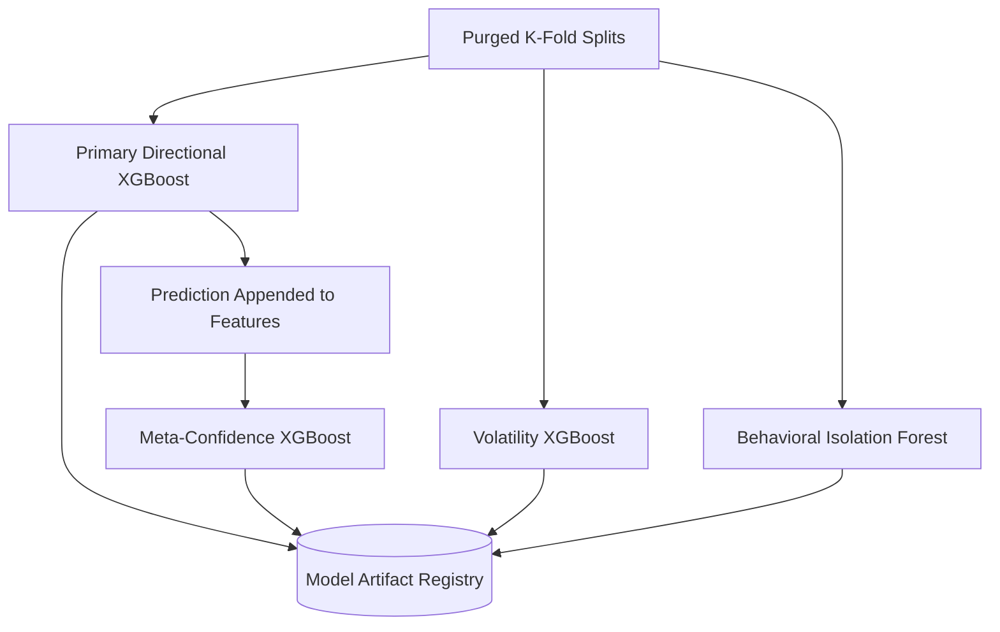

# Phase 6: Model Training

## 1. Primary Purpose & Problem Solved
The **Model Training** phase is the cognitive core of the Institutional Adaptive Risk Intelligence Engine. Its primary purpose is to fit specialized, highly calibrated machine learning models to predict distinct, high-dimensional market behaviors (e.g., directional trend probability, transaction success metrics, expected volatility expansions, and structural execution anomalies) using historical training matrices.

### Catastrophic Failure Mode
If this phase is configured using standard, off-the-shelf data science workflows, the system will suffer from **temporal information leakage and extreme model over-parametrization**:
* **The "K-Fold Leakage" Trap:** Implementing standard, randomized K-Fold cross-validation on time-series data. In finance, adjacent rows are highly correlated (especially when using overlapping path-dependent labels from Phase 4). Random splits leak future data from the test set into the training set, producing beautiful but completely fraudulent training metrics (e.g., AUC of 0.95) that perform worse than random coin flips in real-time trading.
* **Model Overfitting (Memorizing Noise):** Financial data is characterized by an extremely low signal-to-noise ratio. Training deep, complex models without strict capacity constraints, early stopping, and strong regularization will result in a model that perfectly memorizes historical noise, ensuring rapid capital drawdowns in out-of-sample execution.
* **Uncalibrated Confidence Probabilities:** Tree models (like XGBoost) output raw decision margins that do not represent true empirical probabilities. Sizing positions using uncalibrated outputs will lead to catastrophic leverage calculation errors in the Risk Sizing Engine.

---

## 2. Architecture & Data Flow
* **Inputs:**
  * Clean, orthogonal feature matrix ($X$) from Phase 3, combined with Regime Labels from Phase 5.
  * Path-dependent target vectors ($y_{primary}, y_{meta}$) from Phase 4.
* **Outputs:**
  * Highly optimized, serialized, and version-controlled model weight artifacts (e.g., JSON or binary serialized XGBoost objects) registered in the Model Registry.
* **Internal Processing:**
  1. **Purged & Embargoed Splitting:** Segment the historical matrix chronologically using walk-forward cross-validation combined with Purged and Embargoed K-Fold splits. This strictly deletes training samples that overlap with the testing set time horizon ($T1$ barrier) and adds an additional embargo buffer to eliminate autocorrelative leakage.
  2. **Primary Directional Fitting:** Train a highly regularized gradient boosted classifier (XGBoost) to predict the directional market target ($y_{primary}$).
  3. **Meta-Model Confidence Fitting:** Append the predictions of the Primary Model back into the feature set and train a secondary classifier (Meta XGBoost) to predict the probability ($y_{meta}$) that the primary model's prediction is correct.
  4. **Volatility Estimation Fitting:** Fit a specialized regression model (XGBoost Regressor) targeting expected forward volatility (RMSE minimized over EWMA baselines).
  5. **Behavioral Anomaly Fitting:** Fit an unsupervised Isolation Forest on raw trade execution features to establish a baseline of normal institutional trade execution.
  6. **Probability Calibration:** Apply Platt Scaling or Isotonic Regression to the output probabilities of the Meta XGBoost classifier to align predicted scores with real-world empirical frequencies.

---

## 3. Deep Dive: What to Study in Detail
To build a statistically sound financial machine learning training pipeline, you must study several advanced methodology concepts:
* **Purged and Embargoed K-Fold Cross-Validation:** Deeply study Marcos Lopez de Prado's formulations. Master why we must **purge** samples whose labeling period overlaps with the test set, and why we must apply an **embargo** to historical data *following* the test set to account for autoregressive memory.
* **Walk-Forward Validation:** Understand how to implement rolling anchors and expanding historical windows for walk-forward testing to simulate realistic system evolution over years of market data.
* **Gradient Boosted Decision Trees (GBDTs):** Master the internals of the XGBoost algorithm. Focus on parameters that control overfitting: `max_depth` (keep small: 2-5), `min_child_weight`, `subsample`, `colsample_bytree`, and L1/L2 regularization (`alpha`, `lambda`).
* **Unsupervised Anomaly Detection:** Study the mathematics of **Isolation Forests**, specifically path length calculation in random trees, and how it is used to detect systemic anomalies or outlier market environments.
* **Model Calibration Techniques:** Study **Isotonic Regression** and **Platt Scaling** (logistic calibration). Understand how to construct reliability diagrams and calculate the Expected Calibration Error (ECE) to ensure model confidence percentages align perfectly with trade win-rates.
* **Feature Importance & Interpretability:** Study SHAP (SHapley Additive exPlanations), Mean Decrease Impurity (MDI), and Mean Decrease Accuracy (MDA) feature importances to verify the system is not relying on spurious features.

---

## 4. System Boundaries & Dependencies
* **What it MUST NOT do:**
  * **No Random Splitting:** Standard randomized cross-validation is absolutely prohibited.
  * **No Global Feature Tuning:** Hyperparameter optimization (e.g., GridSearch) must never be executed on the entire dataset. It must be strictly nested within the purged training folds to prevent out-of-sample hyperparameter leakage.
  * **No Direct Live Execution Interaction:** This phase has no access to live exchange APIs. It purely generates static weights.
* **Connection to Next Phase:**
  The serialized, validated, and calibrated model weight artifacts are stored securely in a MLOps Model Registry and subsequently loaded by Phase 7 (Ensemble System) to execute real-time inference.
