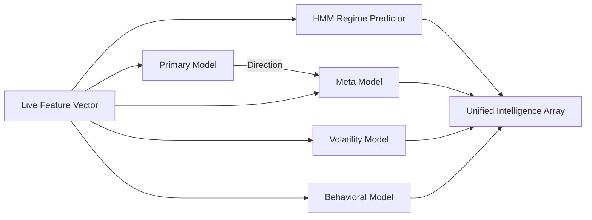

# Phase 7: Ensemble System

## 1. Primary Purpose & Problem Solved
The **Ensemble System** is the cognitive aggregator of the Institutional Adaptive Risk Intelligence Engine. Its primary purpose is to load the suite of specialized, independent models trained in Phase 6, ingest the live market state vector ($X_{live}$), and synthesize these distinct signals into a singular, highly robust, and multi-dimensional probabilistic intelligence array in real-time.

### Catastrophic Failure Mode
If the ensemble logic is missing or implemented as a simple mathematical average, the system will suffer from **uncorrelated model breakdown and probability compression**:
* **The "Blind Spot" Decay:** All financial models suffer from edge decay as specific market dynamics shift. If the system relies on a single model, the entire trading system's profitability will decay to zero once that model's specific edge fades. An ensemble provides structural resilience by combining orthogonal perspectives.
* **Catastrophic Probability Averaging:** Naively averaging the probability scores of models trained on completely different objectives (e.g., averaging the 0-1 probability of a classification model with the volatility scale of a regression model, or averaging uncalibrated probabilities) produces compressed, meaningless signals around 0.50, completely neutralizing the system's ability to size trades effectively.
* **Schema Mismatch Crash:** In a live production environment, if the feature engineering layer updates its schema (e.g., adding a feature or changing column order) but the loaded models are not aligned, the system will execute inference on misaligned inputs, generating garbage predictions that lead to massive trading losses.

---

## 2. Architecture & Data Flow
* **Inputs:**
  * Real-time live feature state vector ($X_{live}$) from Phase 3's Feature Engineering layer.
  * Serialized model artifacts loaded into memory from the Phase 6 model registry.
* **Outputs:**
  * A unified `EnsembleOutputs` object containing:
    * Directional Bias (Primary model log-odds/probability).
    * Meta-Model Confidence (empirical success probability of that directional bias).
    * Expected Volatility scale (volatility model prediction).
    * Behavioral Anomaly Score (Isolation Forest distance metric).
    * Latent Regime State (HMM current regime classification).
* **Internal Processing:**
  1. **Regime Ingestion:** First, feed the stationary subset of $X_{live}$ through the Hidden Markov Model (HMM) to classify the active regime state.
  2. **Directional Pass:** Pass the complete $X_{live}$ vector through the Primary directional model to generate a directional log-odds score (Buy vs. Sell).
  3. **Sequential Stacking:** Append the predicted directional output directly to the live feature vector $X_{live}$. Pass this augmented vector immediately through the Meta-Model classifier to generate the calibrated Meta-Confidence score (probability of directional success).
  4. **Parallel Risk Ingestion:** Concurrently pass $X_{live}$ through the Volatility regression model and the Isolation Forest anomaly detector to generate expected trade-drawdown bounds and behavior scores.
  5. **Schema Verification:** Ensure all input arrays match the strict dimension boundaries expected by each serialized model prior to calculation.
  6. **Telemetry Packaging:** Bundle the outputs into a standardized `EnsembleOutputs` container and log the entire execution footprint.

---

## 3. Deep Dive: What to Study in Detail
To construct a highly performant live model ensembling system, master the following technical fields:
* **Model Stacking and Meta-Ensembling:** Study how hierarchical stacking works, specifically the sequential handoff from primary directional models to meta-confidence classifiers.
* **Probability and Log-Odds Aggregation:** Learn why log-odds margins ($\ln(\frac{p}{1-p})$) are mathematically superior to raw probability averages when combining multiple classifiers, and how to perform dynamic log-odds scaling.
* **Low-Latency Inference Pipeline Engineering:** Learn how to optimize inference speeds using high-performance runtime engines like ONNX (Open Neural Network Exchange) or TensorRT instead of raw Python execution.
* **Thread-Safe Concurrent Inference:** Study multi-threaded model execution (using libraries like Threading or multiprocessing in Python) to run directional, volatility, and anomaly models concurrently to keep total inference time < 25ms.
* **Strict Type and Schema Validation:** Master structural data validation frameworks (such as Pydantic or NumPy structural schemas) to prevent misaligned input arrays from ever reaching serialized models.

---

## 4. System Boundaries & Dependencies
* **What it MUST NOT do:**
  * **No Hardcoded Trading Rules:** The ensemble must not evaluate trade permissions, set stop-losses, or determine capital allocations. It is a **pure intelligence generator**.
  * **No Mathematical Averaging of Incompatible Metrics:** It must never mix directional signals with volatility parameters in its raw aggregation layers.
  * **No Network Wait Loops:** Inference must occur completely in memory. It must never perform external network I/O operations (e.g., querying external database tables) during the inference execution cycle.
* **Connection to Next Phase:**
  The `EnsembleOutputs` package is passed directly into Phase 8 (Policy Engine) and Phase 9 (Threshold Engine) to undergo strict risk filtering and statistical conviction validation.
