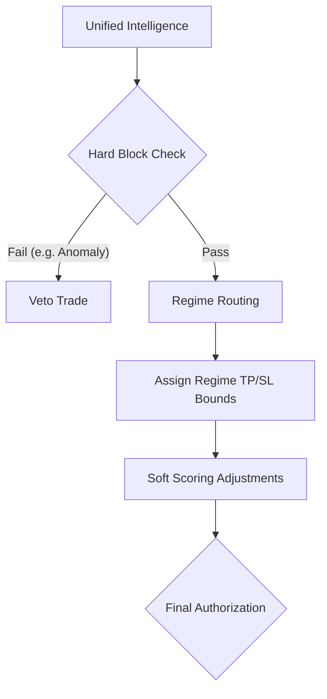

# Phase 8: Policy Engine

## 1. Primary Purpose & Problem Solved
The **Policy Engine** serves as the deterministic guardian and chief risk officer of the Institutional Adaptive Risk Intelligence Engine. Its primary purpose is to act as the unyielding institutional authority, enforcing hard risk constraints and modifying or vetoing trading signals based on systemic context (e.g., portfolio drawdowns, transaction streaks, market crashes, and severe illiquidity) before capital is allocated.

### Catastrophic Failure Mode
If the Policy Engine is bypassed or skipped, the system will suffer from **existential portfolio ruin during black-swan events**:
* **Existential ML Blindness:** Machine learning models have no innate understanding of bankruptcy, liquidations, or regulatory lockups. An XGBoost model will happily recommend buying a highly volatile asset during a systemic stablecoin de-peg or an exchange hack if the mathematical patterns resemble a local bottom. The Policy Engine prevents this model blindness from wiping out the fund.
* **The "Emotional" Streak Bleedout:** Downstream execution engines can get caught in a feedback loop during periods of rapid market regime changes. If the model experiences a long streak of consecutive losses, a naive system will continue to trade at full sizing, driving the account into a deep, unrecoverable drawdown.
* **Circular Soft Locking:** A poorly designed policy cascade can introduce circular dependencies in its risk-reduction functions, permanently locking the system's risk limits to zero even after the market has stabilized, effectively starving the engine of trading opportunities.

---

## 2. Architecture & Data Flow
* **Inputs:**
  * Aligned `EnsembleOutputs` package from Phase 7 (incorporating HMM regimes and anomaly scores).
  * Real-time portfolio metrics (current equity, peak equity, active drawdown, consecutive loss streaks).
  * Real-time microstructure risk parameters (orderbook bid-ask spreads, local market liquidity depth).
* **Outputs:**
  * A `PolicyDecision` authorization object containing:
    * Absolute Allow/Reject veto state (binary).
    * Soft Risk Modifiers (e.g., a scale factor from 0.0 to 1.0 to slash trade sizing).
    * Dynamic Regime-routed bounds (dynamic Take Profit and Stop Loss boundary instructions).
* **Internal Processing:**
  1. **Hard Veto Evaluation:** Run the incoming signal through a zero-trust cascading rule checklist. Immediately block and veto execution if:
     * Systemic crash mode is active (`crash_mode = True`).
     * Current portfolio drawdown exceeds the institutional limit (e.g., > 5.0% trailing drawdown).
     * Local market bid-ask spread is too wide, indicating extreme illiquidity.
     * The Behavioral Anomaly Score from the Isolation Forest is above the critical threshold (e.g., > 0.80).
  2. **Regime-Routed Bounds Calibration:** Route the trade parameters based on the HMM regime. For example:
     * *High Volatility Regime:* Assign wider, protective Stop Loss bounds to prevent noise-based stop-outs.
     * *Low Volatility Chop:* Compress Take Profit bounds to capture quick mean-reverting moves.
  3. **Consecutive Streak Throttling:** Check the active consecutive loss count. Progressively scale down the `soft_modifier` multiplier (e.g., reducing risk allocation by 20% for every consecutive loss beyond 3) to enforce portfolio cooling.
  4. **Authorization Logging:** Write the exact decision path and active rule states to the immutable audit database.

---

## 3. Deep Dive: What to Study in Detail
To design an ironclad, high-security risk policy framework, master the following operational and quantitative concepts:
* **Deterministic Rules Engine Architecture:** Study structural patterns for writing robust, maintainable, and verifiable cascading rulesets (e.g., Rete algorithm, pattern matching, or declarative rule schemas).
* **Quantitative Risk Management & Drawdown Control:** Learn about trailing drawdowns, peak-to-trough calculations, and risk-budgeting frameworks.
* **Microstructure Liquidity Assessment:** Master how to calculate real-time bid-ask spreads, orderbook slippage estimates for various order sizes, and bid-ask depth variance.
* **Behavioral Panic Modeling (Circuit Breakers):** Study how major traditional exchanges implement trading halts and circuit breakers, and adapt these principles for digital asset execution.
* **Zero-Trust Software Engineering:** Learn to write defensive code where every upstream component is treated as potentially compromised. Ensure the Policy Engine relies on independent, direct data inputs rather than depending on the ML model's own self-reported risk assessments.

---

## 4. System Boundaries & Dependencies
* **What it MUST NOT do:**
  * **No Signal Conviction Filtering:** The Policy Engine must **never** decide if a signal is "strong enough" to trade. That is the job of Phase 9 (Threshold Engine). The Policy Engine exclusively filters the *safety of the environment* and *state of the portfolio*.
  * **No Direct Order Execution:** It does not send orders to the exchange. It strictly authorizes or vetoes the signal.
  * **No Final Dollar Sizing:** It does not calculate final USD position sizing; it outputs scaling factors (e.g., "slash allocation by 50%") which are consumed by the Risk Sizing Engine.
* **Connection to Next Phase:**
  Authorized trade instructions, modified risk scales, and regime-routed TP/SL parameters are packaged and dispatched to Phase 9 (Threshold Engine) for statistical thresholding.
