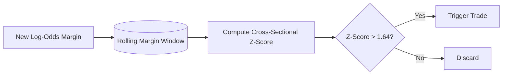

# Phase 9: Threshold Engine

## 1. Primary Purpose & Problem Solved
The **Threshold Engine** is the statistical gatekeeper of the Institutional Adaptive Risk Intelligence Engine. Its primary purpose is to dynamically evaluate whether a model's output signal has sufficient conviction to justify execution. It continuously adapts to the shifting historical distribution of model predictions, ensuring the system only triggers trades on high-conviction outliers relative to recent market contexts.

### Catastrophic Failure Mode
If the system lacks an adaptive threshold engine and instead uses static thresholds, it will suffer from **signal starvation or catastrophic over-trading**:
* **The "Probability Drift" Trap (Static Threshold Failure):** In financial markets, model probability outputs drift. In a quiet sideways market, the meta-model's output confidence scores might compress, oscillating strictly between 0.49 and 0.51. If the system uses a static threshold (e.g., `if probability > 0.60`), it will trigger **zero trades** for months, starving the fund. Conversely, in a highly volatile market, the model might continuously output 0.70 confidence, triggering massive over-trading and exhausting capital via trading fees.
* **The Uncalibrated Signal Bias:** Raw model outputs do not represent actual empirical success probabilities. If the model outputs are uncalibrated and passed through a static filter, the system will execute trades with a negative mathematical expectation under the false assumption of strong conviction.

---

## 2. Architecture & Data Flow
* **Inputs:**
  * Meta-Model confidence probabilities or raw log-odds margins from Phase 7 (via Phase 8 clearance).
* **Outputs:**
  * Binary execution trigger (True/False) signaling whether the statistical conviction threshold is cleared.
* **Internal Processing:**
  1. **Rolling Output Buffer:** Maintain a thread-safe rolling statistical buffer of the model's raw log-odds margins (e.g., a window of the last 1,000 bars/inferences).
  2. **Z-Score Calculation:** Calculate the cross-sectional Z-Score of the current live log-odds signal ($Signal_{live}$) against the rolling statistical window:
     $$Z = \frac{Signal_{live} - \mu_{window}}{\sigma_{window}}$$
  3. **Percentile Cutoff Filtering:** Evaluate the Z-Score against a strict statistical confidence threshold (e.g., $Z > 1.64$, representing the 95th percentile of recent model outputs).
  4. **Extreme Value Gating:** (Optional) Apply Extreme Value Theory thresholds to filter out highly volatile prediction artifacts that indicate structural ML failure rather than genuine market edge.
  5. **Execution Dispatch:** If the threshold is cleared, output `Trigger = True` and dispatch the trade candidate. If not cleared, silently discard the signal.

---

## 3. Deep Dive: What to Study in Detail
To design and calibrate an adaptive thresholding engine, master the following statistical domains:
* **Dynamic Thresholding Methodologies:** Study how rolling statistical boundaries adapt to distribution drift in predictive models.
* **Rolling Statistics & Buffer Structures:** Understand how to build high-performance rolling buffers (e.g., Welford's algorithm for computing running mean and variance without floating-point degradation).
* **Extreme Value Theory (EVT):** Study EVT and the Generalized Pareto Distribution to model tail behavior in financial time-series and ML prediction margins, protecting the system from anomalous out-of-distribution spikes.
* **Z-Score and Normal Distribution Bounds:** Understand standard normal distributions, cumulative distribution functions (CDFs), and statistical hypothesis testing (one-tailed vs. two-tailed tests).
* **Signal Detection Theory:** Study receiver operating characteristic (ROC) curves, precision-recall spaces, and the mathematics of maximizing true positives while minimizing false alarms under varying signal-to-noise ratios.

---

## 4. System Boundaries & Dependencies
* **What it MUST NOT do:**
  * **No Static Probability Hardcoding:** Under no circumstances should the system utilize hardcoded probability limits (e.g., `probability > 0.60`). Everything must be scaled dynamically via statistical distributions.
  * **No Volatility Risk Sizing:** It does not calculate the size of the position or assign profit/loss boundaries. It purely decides *if* the trade is authorized to proceed based on signal quality.
  * **No Feature Engineering:** It does not recalculate features; it operates purely on the outputs of the model ensemble.
* **Connection to Next Phase:**
  Approved, high-conviction trade candidates are passed directly to Phase 10 (Risk Sizing Engine) to calculate the precise capital allocation and bracket parameters.
