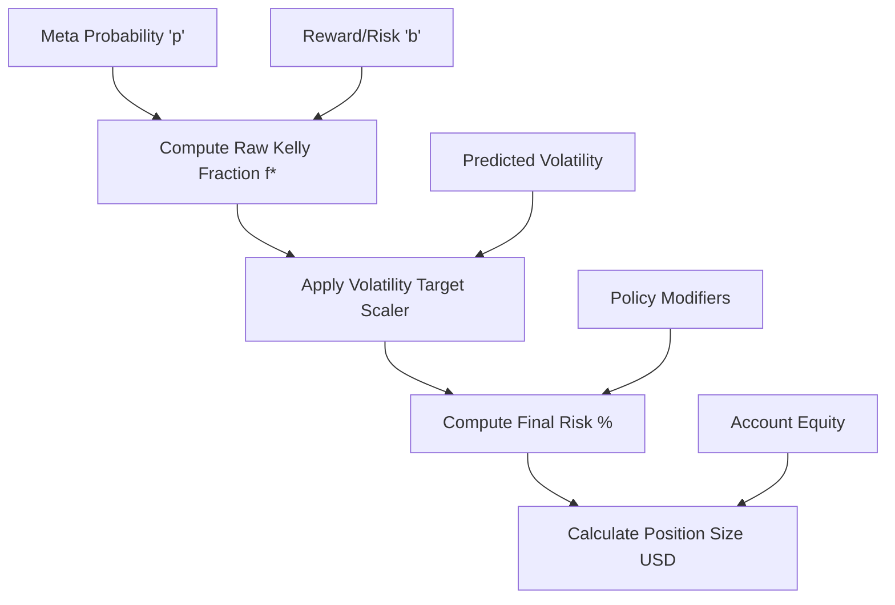

# Phase 10: Risk Sizing Engine

## 1. Primary Purpose & Problem Solved
The **Risk Sizing Engine** is the mathematical optimizer and survival coordinator of the Institutional Adaptive Risk Intelligence Engine. Its primary purpose is to calculate the exact capital allocation, leverage, and absolute bracket boundaries (Take Profit and Stop Loss prices) for each trade. It maximizes the geometric growth rate of the portfolio (capital compounding) while strictly enforcing constant portfolio variance, protecting the institution from devastating drawdowns.

### Catastrophic Failure Mode
If this phase is skipped or implemented using static position sizes (e.g., trading a fixed $10,000 size on every signal), the system will face **geometric decay and inevitable bankruptcy**:
* **The "Full Kelly" Gambler's Ruin:** Naively applying the theoretical full Kelly Criterion mathematically guarantees catastrophic drawdowns (often exceeding 50% to 80%) in non-stationary financial markets. Because model probabilities and reward-to-risk ratios are estimated with error, full Kelly sizing will inevitably over-leverage a string of bad trades, destroying the fund.
* **The Volatility Blindness Drawdown:** Allocating a fixed percentage of capital (e.g., 2% risk) without scaling for localized volatility. Sizing a trade in a highly volatile market (e.g., 5% ATR) with the same percentage leverage as a quiet market (e.g., 0.5% ATR) will result in rapid, consecutive stop-outs during high-volatility regimes, introducing massive portfolio variance.
* **Arithmetic Decay:** Over-allocating capital on low-probability trades while under-allocating on high-probability setups leads to negative compounding (geometric drag), where the portfolio fails to grow even if the average trade return is positive.

---

## 2. Architecture & Data Flow
* **Inputs:**
  * Meta-Model confidence probability ($p$) from Phase 7 (via Phase 9 trigger).
  * Dynamic Take Profit/Stop Loss multipliers (Reward-to-Risk ratio $b$) routed from Phase 8.
  * Real-time portfolio equity (total account balance and free margin).
  * Volatility metrics (predicted forward volatility and current Average True Range).
  * Policy Engine soft scaling modifiers.
* **Outputs:**
  * An executable `RiskConfiguration` package containing:
    * Exact position size in USD (and native asset units).
    * Target Leverage.
    * Exact, absolute execution limit prices (Entry, Stop Loss, and Take Profit prices).
    * Maximum risk percentage assigned to the trade.
* **Internal Processing:**
  1. **Reward-to-Risk Evaluation:** Calculate the dynamic reward-to-risk ratio ($b$) using the regime-routed TP/SL multipliers from Phase 8:
     $$b = \frac{TP_{multiplier}}{SL_{multiplier}}$$
  2. **Raw Kelly Fraction Computation:** Compute the unadjusted optimal Kelly fraction ($f^*$) based on the Meta-Model success probability ($p$):
     $$f^* = \frac{p \cdot (b + 1) - 1}{b}$$
  3. **Fractional Kelly Scaling:** Scale the raw fraction using a strict fractional multiplier (e.g., $0.25$ or $0.5$ for Quarter-Kelly or Half-Kelly) to build a wide safety margin against parameter estimation error.
  4. **Volatility Target Scaling:** Modulate the fractional Kelly size inversely against the predicted volatility to target a constant, stable portfolio variance across all market environments.
  5. **Policy Modifier Application:** Multiply the adjusted fraction by the Policy Engine's soft modifiers (streak counters, drawdown blocks) to establish the final risk percentage.
  6. **Absolute Limit Calculations:** Read the current price and ATR. Calculate the exact absolute Stop Loss and Take Profit price boundaries:
     $$StopLoss = EntryPrice - (SL_{multiplier} \cdot ATR)$$
     $$TakeProfit = EntryPrice + (TP_{multiplier} \cdot ATR)$$
  7. **USD Position Conversion:** Translate the final risk percentage and stop-loss distance into absolute USD position size, ensuring it respects the absolute safety cap (e.g., maximum 2.0% risk per trade).

---

## 3. Deep Dive: What to Study in Detail
To construct a state-of-the-art capital allocation engine, deeply study these quantitative methodologies:
* **The Kelly Criterion:** Master the mathematical derivation of the Kelly Criterion. Understand the proof of why maximizing geometric growth differs from maximizing arithmetic return.
* **Fractional Kelly Sizing:** Study the impact of parameter uncertainty (estimation error in $p$ and $b$) and why Half-Kelly or Quarter-Kelly sizing maximizes utility under uncertainty.
* **Constant Volatility Target Scaling (Risk Budgeting):** Learn how to dynamically scale exposure inversely to realized volatility (using ATR or GARCH models) to maintain a constant daily portfolio volatility target (e.g., targeting a 15% annualized portfolio volatility).
* **Geometric Mean Maximization & Asset Drag:** Study "geometric drag" and how portfolio variance reduces long-term growth rates, and how optimal risk sizing mitigates this drag.
* **Leverage and Margin Optimization:** Understand exchange margin mechanics, maintenance margin requirements, and liquidation pricing equations to ensure leverage limits never trigger exchange-side liquidations.

---

## 4. System Boundaries & Dependencies
* **What it MUST NOT do:**
  * **No Directional Bias Ingestion:** Sizing must remain completely blind to whether the trade is a Buy or a Sell. Sizing calculations are strictly driven by statistical probability, risk, volatility, and capital boundaries.
  * **No Trade Decision Logic:** It does not decide whether a trade should exist. It assumes that if a signal enters this phase, it has already been authorized.
  * **No Direct Order Submission:** It does not communicate with the broker's API; it passes the exact mathematical instructions forward.
* **Connection to Next Phase:**
  The computed risk configuration (exact USD size, entry price, SL price, and TP price) is passed to Phase 11 (Trade Decision Engine) to package the final immutable execution instruction.
