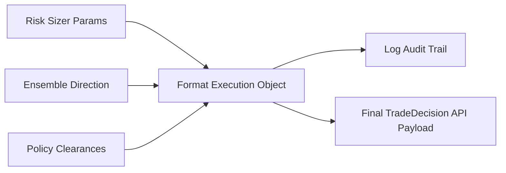

# Phase 11: Trade Decision Engine

## 1. Primary Purpose & Problem Solved
The **Trade Decision Engine** acts as the formal API gateway and structural boundary of the Institutional Adaptive Risk Intelligence Engine. Its primary purpose is to collect the directional predictions, risk boundaries, policy clearances, and position sizes calculated across all prior phases and package them into a standardized, immutable execution payload (`TradeDecision`). It provides a clean, audit-compliant separation between the quantitative intelligence layers and downstream physical execution infrastructure.

### Catastrophic Failure Mode
If this phase is neglected or designed as a loose, dynamic payload (e.g., passing raw unstructured dicts across internal functions), the system will face **execution corruption and auditing black holes**:
* **The "Telemetry Loss" Audit Failure:** If a model makes a series of highly unprofitable trades in production, but the exact input features, model probabilities, and active risk policies were not preserved *alongside* the execution order, it is impossible for quantitative researchers to diagnose *why* the failure occurred. This lack of auditability makes institutional compliance and continuous model improvement impossible.
* **Payload Drift Corruption:** If the risk parameters are modified on-the-fly during network transit to the execution API, the system can execute incorrect sizes or place stops in the wrong locations, bypassing the Policy Engine's strict safety checks.
* **Race Condition Signal Mismatch:** In high-frequency environments, if signals are not tightly bound to the exact state indices that generated them, the execution system may execute an old signal on a new market bar, resulting in instant execution slippage.

---

## 2. Architecture & Data Flow
* **Inputs:**
  * Directional signal and Meta-Confidence probability from Phase 7.
  * Policy Engine approvals and regime mappings from Phase 8.
  * Statistical threshold Z-scores from Phase 9.
  * Exact USD position sizes, entry limits, and TP/SL boundaries from Phase 10.
* **Outputs:**
  * A JSON-serializable, strictly validated, and cryptographically hashed `TradeDecision` data payload.
  * A comprehensive, immutable audit log entry in the system's centralized database.
* **Internal Processing:**
  1. **Data Integration:** Aggregate all raw values (Direction, Entry Limit Price, Stop Loss Price, Take Profit Price, Target Size USD, Regime State, Active Meta Probability, and Generation Time) into a standardized Python dataclass or Pydantic model.
  2. **Strict Schema Validation:** Run the data through rigorous type, range, and presence validations (e.g., ensuring Stop Loss prices are strictly below Entry prices for Buy trades, and position sizes are strictly greater than zero).
  3. **Cryptographic Signatures:** Calculate a cryptographic hash (SHA-256) of the entire payload to act as a unique, tamper-proof Transaction ID.
  4. **Immutable Log Dispatch:** Write the entire validated `TradeDecision` record, along with the exact feature vector $X_{live}$ that generated it, to the persistent audit database.
  5. **Payload Serialization:** Serialize the validated object into a lightweight JSON string and dispatch it to the downstream routing layer.

---

## 3. Deep Dive: What to Study in Detail
To design a secure, high-performance API and auditing boundary, focus on the following disciplines:
* **Strict Schema & Type Enforcement:** Master data validation frameworks such as **Pydantic** or Marshmallow. Understand how to write custom validators and enforce strict type coercion.
* **Serialization Performance Optimization:** Study the latency profiles of various serialization formats (JSON, MessagePack, Protocol Buffers) and how to optimize serialization latency to sub-millisecond ranges.
* **Centralized, Structured Auditing Frameworks:** Learn how to implement structured logging using JSON loggers (e.g., structlog in Python), ensuring all logs are machine-readable and easily indexable by log aggregators (ElasticSearch, Datadog).
* **Immutable Software Patterns:** Study the design of immutable data structures (frozen dataclasses, named tuples) in programming to ensure that once a decision is made, it cannot be modified by downstream services.
* **Cryptographic Tamper-Proofing:** Learn how to generate SHA-256 hashes of complex structured data objects to serve as immutable digital signatures for compliance audits.

---

## 4. System Boundaries & Dependencies
* **What it MUST NOT do:**
  * **No Market Data Analysis:** This engine is completely blind to current prices or indicators. It does not perform any calculations, averages, or transformations; it purely packages existing data.
  * **No Risk-Limit Modifications:** It must never alter the size, stop distances, or entry prices calculated by the prior engines.
  * **No Exchange Execution Management:** It does not manage exchange orders, tracking fills, or handling API socket connections. It simply emits the instruction payload.
* **Connection to Next Phase:**
  The validated, immutable `TradeDecision` payload is serialized and dispatched. In historical backtesting and strategy staging, it routes directly to Phase 12 (Paper Trading). In live operations, it is concurrently routed to Phase 15 (Deployment & MLOps execution daemon).
