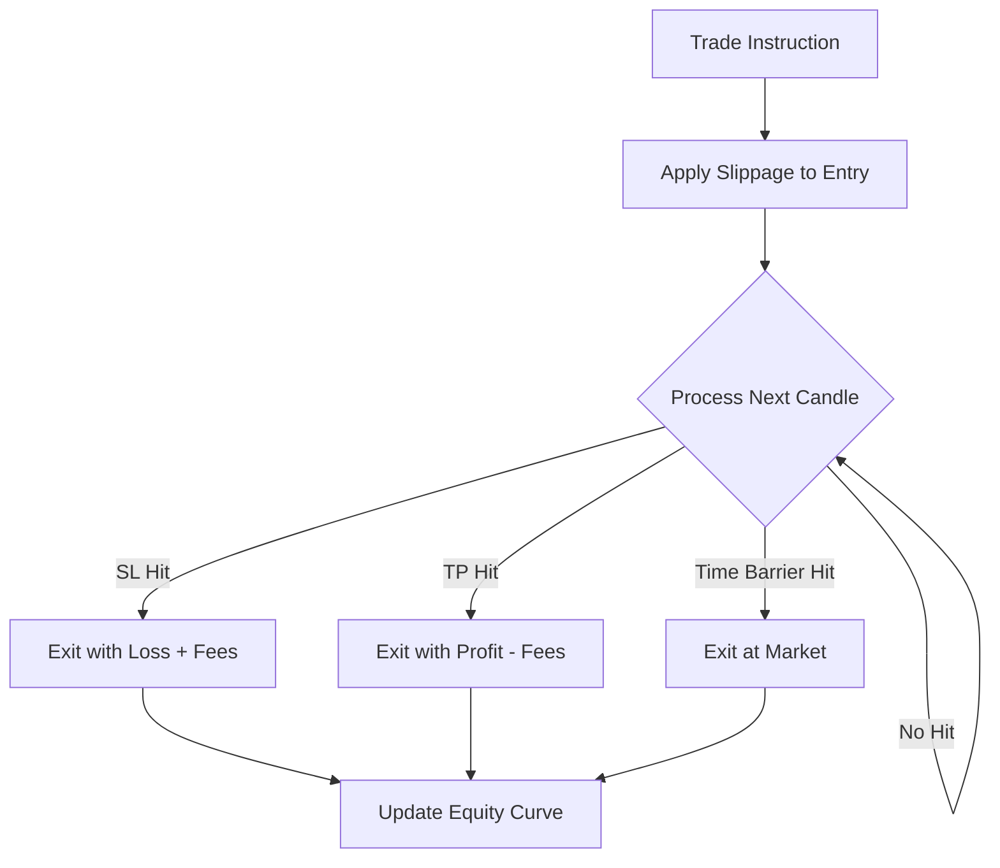

# Phase 12: Paper Trading

## 1. Primary Purpose & Problem Solved

The **Paper Trading** phase is the simulation validator of the Institutional Adaptive Risk Intelligence Engine. Its primary purpose is to execute the immutable `TradeDecision` objects generated in Phase 11 within a realistic, high-fidelity, and friction-filled environment. It provides an essential out-of-sample verification layer, ensuring that the system's theoretical mathematical edges are capable of surviving the realities of physical market execution (slippage, fees, and execution latency) prior to live capital deployment.

### Catastrophic Failure Mode

If this verification phase is skipped or engineered with simplistic assumptions, the system will fall victim to **the "Backtest Optimism" delusion**:

* **The Zero-Friction Illusion:** Assuming that positions can be 100% filled at the exact closing price of a bar with zero fees and zero slippage. In real markets, entering a large position sweeps the orderbook, increasing entry costs (slippage). Ignoring these factors will turn a highly profitable backtest into a massive money-losing strategy in production.
* **The "Same-Candle Resolution" Peeking Bias:** If the High and Low of a single candle both touch the Stop Loss and the Take Profit boundaries respectively, a naive simulation will assume the Take Profit was hit first, recording a "win." In reality, the Stop Loss is often hit first, leading to a loss. Failing to enforce pessimistic bracket resolution results in highly inflated win-rates that collapse instantly in live environments.
* **Open-Bar Execution Peeking:** Executing a trade at the 'open' price of the exact bar that generated the signal. This is a severe lookahead bias, as the signal was calculated using the close price of that bar, meaning the entry must occur at the open of the *next* bar, incorporating a delay.

---

## 2. Architecture & Data Flow

* **Inputs:**
  * Immutable `TradeDecision` instruction payloads from Phase 11.
  * Real-time and historical tick/bar market streams (High, Low, Open, Close, Volume) from Phase 2.
  * Local exchange fee profile configurations (Maker/Taker fees, VIP tiers).
* **Outputs:**
  * Simulated execution results, including detailed trade logs (fill times, absolute exit prices, fee costs).
  * Continuous, updated Equity Curve and performance telemetry (PnL, Sharpe Ratio, Sortino Ratio, Max Drawdown).
* **Internal Processing:**
  1. **Event-Driven Execution Ingestion:** Consume trade instructions asynchronously inside an event loop.
  2. **Frictional Entry Calibration:** Apply institutional taker fees and calculate market impact slippage based on localized orderbook depth and target size. The final entry price is calculated as:
     $$Entry_{simulated} = Price_{entry} + Slippage_{impact}$$
  3. **Path Resolution Monitoring:** As subsequent market ticks or bars arrive, track the price path relative to the active Stop Loss, Take Profit, and Temporal Timeout ($T1$) boundaries.
  4. **Pessimistic Bracket Resolution:** If a single bar's range spans both the SL and TP:
     * *Pessimistic rule:* Enforce the Stop Loss trigger first. Exit the position with a loss and record the taker fee.
  5. **Temporal Timeout Execution:** If the trade reaches the maximum time-barrier limit $T1$ without touching the TP or SL, execute an immediate simulated market exit at the close of the $T1$ bar, applying full taker fees and slippage.
  6. **Performance Metric Aggregation:** Calculate daily Sharpe, Sortino, and Calmar ratios. Log the simulated performance metrics to the Monitoring system.

---

## 3. Deep Dive: What to Study in Detail

To construct an ultra-realistic event-driven paper trading simulator, master the following concepts:

* **Event-Driven Software Architecture:** Understand the design of event-driven loops, decoupled trade queues, and state machine transitions for active positions.
* **Market Impact & Slippage Modeling:** Study how to construct slippage models based on market participation rates, volatility, and orderbook depth (e.g., Almgren-Chriss framework).
* **Maker vs. Taker Fee Dynamics:** Learn how exchanges structure maker and taker fee schedules, and how execution routing impacts the total transaction cost.
* **Pessimistic Same-Bar Resolution Algorithms:** Study how to safely handle intraday price path uncertainty when fine-grained tick data is unavailable, ensuring backtests assume worst-case scenarios.
* **Quantitative Portfolio Telemetry:** Understand the mathematical formulas and operational definitions of key portfolio metrics:
  * **Sharpe Ratio:** Reward-to-variability ratio.
  * **Sortino Ratio:** Focuses strictly on downside risk (semi-standard deviation).
  * **Calmar Ratio:** Return relative to Maximum Drawdown.
  * **Maximum Drawdown:** Peak-to-trough drop in equity.

---

## 4. System Boundaries & Dependencies

* **What it MUST NOT do:**
  * **No Future Peeking / Post-Facto Execution:** The simulator must process data chronologically. It must never use information from bar $T+1$ to determine the entry price at bar $T$.
  * **No Direct Wallet Interaction:** It has no access to real capital. It must never submit orders to live exchange accounts.
  * **No Strategy Optimization Logic:** The simulator does not modify strategy parameters; it is a passive, transparent validator of the strategy's current state.
* **Connection to Next Phase:**
  The simulated trade records, fee profiles, and equity curves are streamed directly to Phase 13 (Monitoring & Drift Detection) to serve as the critical baseline for identifying real-time model decay and tracking out-of-sample drift.
