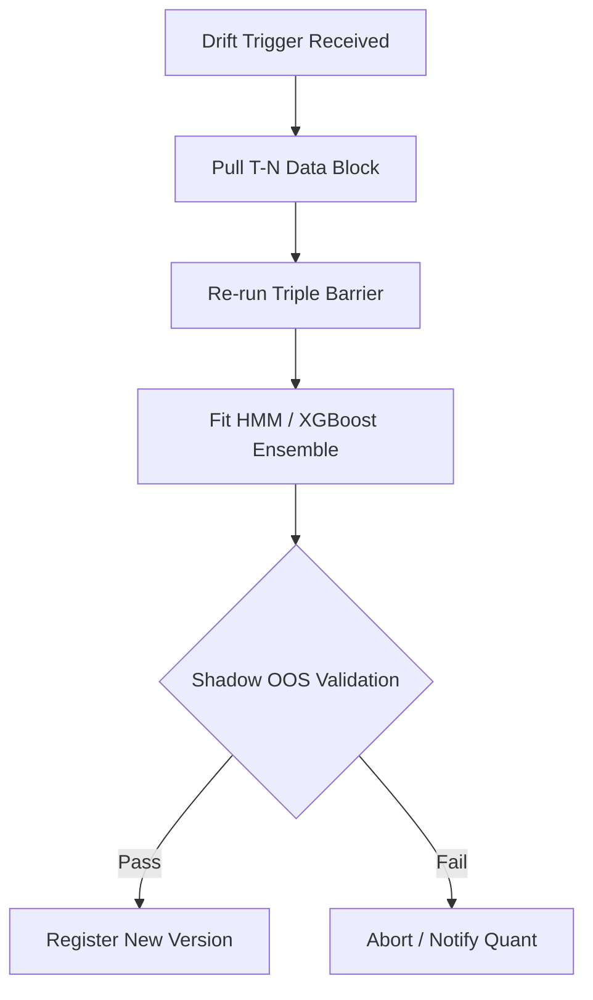

# Phase 14: Online Learning & Retraining

## 1. Primary Purpose & Problem Solved
The **Online Learning & Retraining** phase is the evolutionary engine of the Institutional Adaptive Risk Intelligence Engine. Its primary purpose is to continuously and safely adapt the system's machine learning models to changing market microstructures and concept shifts without manual intervention, automating the preservation of the system's trading edge.

### Catastrophic Failure Mode
If this automated adaptation layer is missing or poorly implemented, the trading system will face **existential edge obsolescence and catastrophic training loops**:
* **Existential Edge Obsolescence:** Financial markets are dynamic and adaptive. A model that is left static will inevitably lose its predictive power as other participants adapt to the same patterns. Without automated retraining, the cost of manual model maintenance will paralyze the research team while production performance decays.
* **The "Catastrophic Forgetting" Pitfall:** If the system is retrained *only* on the most recent short-term data (e.g., training exclusively on the last 2 weeks of extreme volatility to adapt to a sudden crash), it will completely overwrite its historical parameters. Once the market normalizes, the model will have forgotten how to perform in standard environments, causing severe losses.
* **Data Anomaly Pollution:** If the retraining pipeline is triggered by a drift event but the incoming data contains missing candles, price spikes from data feed corruption, or misaligned labels, the model will fit to this corrupted data. Deploying these corrupted weights to production will instantly disable the engine.

---

## 2. Architecture & Data Flow
* **Inputs:**
  * Automated retraining trigger event webhooks from Phase 13 (or scheduled cron triggers).
  * Fresh historical market data blocks pulled from Phase 2's Database and analytical storage.
  * Validated baseline features and parameter configurations.
* **Outputs:**
  * A newly trained, fully validated, and serialized candidate model weight package.
  * A detailed cross-validation and shadow validation performance report registered in the model lineage registry.
* **Internal Processing:**
  1. **Data Pull & Integrity Gating:** Fetch a blended rolling historical data window (e.g., last 6 months of data, incorporating both older baseline regimes and the most recent drift-inducing bars). Run rigorous data integrity checks (e.g., verifying zero missing bars, zero negative volumes).
  2. **Automated Label Engineering:** Execute the Phase 4 dynamic Triple-Barrier labeler across the new dataset.
  3. **Feature Preprocessing:** Execute Phase 3 feature engineering, fractionally differencing the raw prices, recalculating orthogonal features, and filtering out collinear columns.
  4. **Ensemble Retraining:** Re-run the walk-forward, purged cross-validation training pipeline to fit the HMM regime model, the directional XGBoost classifier, the meta-confidence classifier, the volatility regressor, and the Isolation Forest anomaly detector.
  5. **Shadow Out-Of-Sample (OOS) Validation:** Deploy the newly trained candidate model in a isolated **Shadow Mode** concurrent with the current production model.
  6. **Deployment Authorization Gating:** Evaluate the candidate's shadow performance against the production baseline over a validation period. If the candidate achieves the performance delta criteria (e.g., > 2.0% improvement in Sharpe or ECE < 5.0%), authorize the promotion. If it fails, abort, keep the current model active, and alert the quantitative research team.

---

## 3. Deep Dive: What to Study in Detail
To design a secure, fully automated model evolution pipeline, master the following disciplines:
* **Online Learning vs. Periodic Batch Retraining:** Study the trade-offs between continuous incremental gradient updates (Online Learning) and scheduled rolling batch retraining. Understand why rolling batch retraining is generally more stable for tabular financial datasets.
* **Catastrophic Forgetting Mitigation:** Study methods for data blending, experiences replay, and elastic weight consolidation to ensure models retain long-term structural memories across retraining cycles.
* **Shadow Deployment & Canary Testing:** Learn how to design orchestration architectures where shadow models receive live feature vectors and record predictions without executing live orders, comparing their performance in real-time.
* **Automated Hyperparameter Optimization:** Master automated hyperparameter search engines such as **Optuna** and Bayesian Optimization, ensuring they operate strictly inside nested, purged training folds.
* **Model Lineage and Tracking:** Study the deployment of **MLflow** or Weights & Biases to track model parameters, dataset versions, training code hashes, and evaluation metrics, achieving absolute model reproducibility.

---

## 4. System Boundaries & Dependencies
* **What it MUST NOT do:**
  * **No Direct Production Promotion:** The retraining engine must **never** overwrite active production model weights without successfully passing the automated shadow validation gate.
  * **No Ingestion of Unverified Data:** It must never run on unvalidated database tables. Any data gap or schema mismatch must immediately halt the retraining pipeline.
  * **No Core Software Schema Modifications:** The automated trainer must not modify the structure or names of features, only the mathematical weights and model thresholds.
* **Connection to Next Phase:**
  Once a promoted candidate successfully clears the shadow validation gate, its serialized weights and metadata schema are committed to the model registry and pushed directly to Phase 15 (Deployment & MLOps) for zero-downtime container rolling update deployment.
