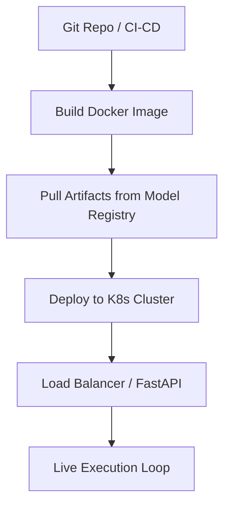

# Phase 15: Deployment & MLOps

## 1. Primary Purpose & Problem Solved
The **Deployment & MLOps** phase is the operational host and systems orchestrator of the Institutional Adaptive Risk Intelligence Engine. Its primary purpose is to containerize, serve, scale, and secure the complete, multi-stage inference pipeline in a highly available, low-latency, and fault-tolerant institutional production environment. It bridges the gap between quantitative research and software engineering, ensuring that live predictions translate safely and reliably into physical market orders.

### Catastrophic Failure Mode
If this MLOps and serving architecture is poorly engineered, the system will face **systemic execution failures and state-loss blindness**:
* **The "State-Loss Reset" Disaster:** Deploying stateful rolling statistical windows (e.g., Phase 9's rolling Z-score buffer or Phase 3's rolling VWAP lines) in stateless docker containers without a remote persistent cache. If the container restarts or undergoes a Kubernetes auto-scale migration, the rolling windows will be wiped clean. The system will start trading with uninitialized, zero-valued statistics, executing catastrophic trades.
* **API Bottlenecks and Out-of-Memory (OOM) Crashes:** During high-volatility spikes, the inference engine's input load scales exponentially. A basic, un-orchestrated serving setup will suffer from thread-starvation or run out of memory, causing Kubernetes to immediately kill the container (OOM Kill), blinding the institution during critical execution windows.
* **Dirty Production Code Deployments:** Directly pulling code from development branches into production environments. Without strict GitOps CI/CD gates, a minor syntax tweak or untested API call will leak into the live loop, crashing the execution engine.

---

## 2. Architecture & Data Flow
* **Inputs:**
  * Promoted and validated model weight artifacts from Phase 14's registry.
  * Verified production inference code from the version control repository.
  * Live exchange API connection credentials and API keys stored in highly secure secret managers.
* **Outputs:**
  * A live, highly optimized REST and WebSocket API endpoint exposing telemetry.
  * Live market orders (limit, market, stop-market) dispatched to physical institutional exchange broker interfaces.
* **Internal Processing:**
  1. **Containerization:** Package the entire Python runtime, feature extraction code, model inference handlers, and dependency trees into a highly optimized, multi-stage Docker container.
  2. **Model Version Binding:** The container pulls the exact, immutable promoted model weight hashes from the Centralized Model Registry (e.g., MLflow Model Registry).
  3. **Kubernetes Orchestration:** Deploy the containers as a stateless replica set inside a Kubernetes (K8s) cluster. Configure a Redis Sentinel cluster or external persistent database to serve as the remote state cache, preserving rolling statistical windows across container restarts.
  4. **FastAPI Inference Interface:** Expose internal telemetry, model confidence logs, and manual emergency kill switches via a high-performance FastAPI framework running on Uvicorn.
  5. **Continuous CI/CD Gating:** Run all incoming code changes through an automated testing pipeline (running unit tests, integration tests, and schema compatibility checks) before building the production image.
  6. **Zero-Downtime Rolling Deployment:** Deploy container updates using progressive rolling updates (or blue-green deployments) to ensure the live execution loop is never interrupted.

---

## 3. Deep Dive: What to Study in Detail
To architect an enterprise-grade financial MLOps and serving ecosystem, master the following fields:
* **Docker Containerization for ML:** Learn how to write highly optimized multi-stage Dockerfiles, minimize container footprint, and prevent Python memory leaks under persistent long-term execution.
* **Kubernetes (K8s) Orchestration & Scaling:** Study Kubernetes deployment configurations, Pod disruption budgets, liveness and readiness probes, and horizontal pod auto-scaling (HPA) using custom Prometheus metrics.
* **Model Registry & Version Control:** Master the integration of **MLflow** or BentoML to manage the complete model lifecycle (Staging, Production, Archived) and track structural lineage.
* **Low-Latency REST/WebSocket API Design:** Learn how to write highly concurrent async endpoints in **FastAPI** utilizing Uvicorn and Gunicorn, minimizing application-level latency.
* **Stateful vs. Stateless Microservices:** Understand how to decouple state from compute. Study how to store rolling time-series buffers in high-speed, persistent remote databases (such as Redis or Memcached) to ensure container restarts do not corrupt running calculations.
* **CI/CD & GitOps Workflows:** Study automated delivery pipelines (GitHub Actions, GitLab CI) and GitOps controllers (ArgoCD) to achieve absolute security, rollback speed, and auditability in production deployments.

---

## 4. System Boundaries & Dependencies
* **What it MUST NOT do:**
  * **No Direct Development Code Pulls:** Production containers must never run development or unvalidated code branches. Everything must clear the strict CI/CD gate.
  * **No Local State Storage:** Containers must not store critical rolling statistical windows or portfolio values in local container memory or local volume mounts. All state must be externalized.
  * **No Model Weight Modification:** The serving container must not modify, adjust, or retrain the model weights during runtime.
* **Connection to Next Phase:**
  This is the final phase of the Institutional Adaptive Risk Intelligence Engine. The system operates as a continuous, closed-loop cybernetic feedback system, feeding physical execution results, transaction fee profiles, and telemetry continuously back into Phase 1 to begin the cycle anew.
